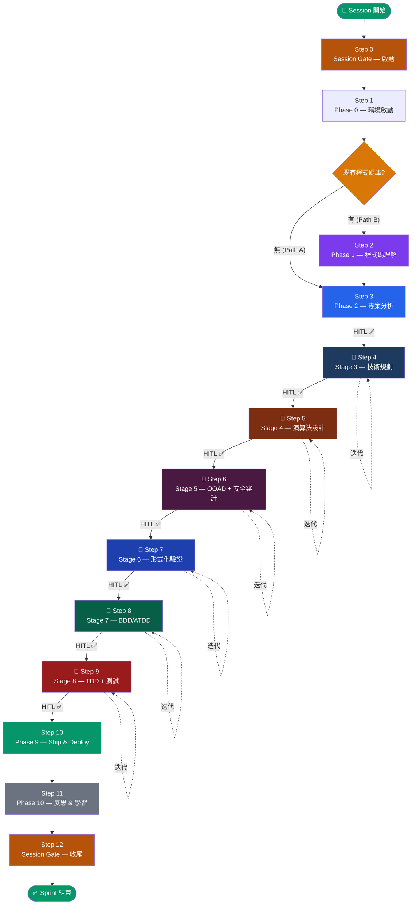

# AI Coding Workflow Configuration

> **Single Source of Truth** for agentic development workflow orchestration.

本目錄管理跨 AI 工具鏈的統一開發流程配置，整合四個子模組為一套端對端迭代管線。

## Architecture

```
ai_coding/
├── AGENTS.md              # 統一執行協議：Step 0-12 結構化步驟 + skill routing
├── README.md              # 本文件：人類參考（流程圖、矩陣、安裝步驟）
├── docs/
│   ├── governance/        # 跨切面治理：追溯、影響分析、變更管理、ADR
│   │   ├── TRACEABILITY.md
│   │   ├── IMPACT-ANALYSIS.md
│   │   ├── TECH-DEBT.md
│   │   ├── CHANGE-MANAGEMENT.md
│   │   └── ADR-GOVERNANCE.md
│   ├── adr/               # ADR 決策紀錄（含變更紀錄 + LESSON）
│   │   ├── ADR-INDEX.md
│   │   ├── ADR-TEMPLATE.md
│   │   └── ADR-GOV-001..021, ADR-STR-001
│   ├── phases/            # Phase 0-2, 9-10 定義
│   ├── stages/            # Stage 3-8 完整定義 + 審查維度
│   ├── workflow-state.md  # 工作流狀態機
│   └── traceability-matrix.md  # 追溯矩陣
└── skills/
    ├── workflow-skills/           # 17 個可執行協議（全部 ## Step N 格式）
    ├── everything-claude-code/    # ECC — 開發護欄、hooks、agents
    ├── gstack/                    # gstack — 工作流引擎（QA、ship、review）
    ├── understand-anything/       # Understand Anything — 程式碼理解、知識圖譜
    └── skillfortify/              # SkillFortify — 供應鏈安全、SBOM
```

## Workflow Pipeline

所有開發任務遵循完整管線 (Step 0-12)，**無簡化路徑**。完整執行定義見 [AGENTS.md](./AGENTS.md)。



### Pipeline Quick Reference

```
Step 0    Session Gate — 啟動（強制）
Step 1    Phase 0: 環境啟動 + Pipeline 完備性檢查
Step 2    Phase 1: /understand (Path B: 既有 codebase)
Step 3    Phase 2: /office-hours → /plan-ceo-review                    → HITL ✅
─── Iterative Pipeline (Dual-Agent α/β Convergence) ───
Step 4    Stage 3: 技術規劃 (T1-T7) + /autoplan                       → HITL ✅
Step 5    Stage 4: 演算法設計 (A1-A22) + skillfortify                  → HITL ✅
Step 6    Stage 5: OOAD + 三層安全審計 (O1-O4)                        → HITL ✅
Step 7    Stage 6: 形式化驗證設計 (V1-V6)                              → HITL ✅
Step 8    Stage 7: BDD/ATDD (B1-B9)                                    → HITL ✅
Step 9    Stage 8: TDD + 測試 + 修復 (D1-D5) + 三層安全 + SonarCloud  → HITL ✅
─── End Iterative Pipeline ───
Step 10   Phase 9: /ship → /land-and-deploy → /canary → /document-release
Step 11   Phase 10: /retro → 技術債 → /understand → /evolve
Step 12   Session Gate — 收尾（強制）
```

**每個 Stage 的迭代迴圈**: Agent α → Agent β → 微驗證 → 不動點判定 →（收斂後）→ HITL
**跨切面治理**: TRACEABILITY.md + IMPACT-ANALYSIS.md + CHANGE-MANAGEMENT.md + ADR-GOVERNANCE.md
**狀態持久化**: workflow-state.md + iteration-log.md

## Tool Responsibility Matrix

| Phase/Stage | UA | gstack | ECC | SkillFortify | 治理層 |
|-------------|:--:|:------:|:---:|:----------:|:------:|
| **Step 0** | — | — | — | — | Session Gate |
| **Step 1 (Phase 0)** | — | Preamble | SessionStart | — | — |
| **Step 2 (Phase 1)** | ★ | — | — | — | — |
| **Step 3 (Phase 2)** | context | ★ | 監控 | — | ID 指派 |
| **Step 4 (Stage 3)** | context | ★ | 監控 | — | ID + 追溯 |
| **Step 5 (Stage 4)** | — | — | — | 掃描 | ID + 追溯 |
| **Step 6 (Stage 5)** | — | ★ /cso | AgentShield | ★ 供應鏈 | ID + 追溯 |
| **Step 7 (Stage 6)** | — | — | — | — | ID + 追溯 |
| **Step 8 (Stage 7)** | — | — | Hooks | — | ID + 追溯 |
| **Step 9 (Stage 8)** | 增量 | Checkpoint | ★ Hooks | — | ID + 追溯 + SonarCloud |
| **Step 10 (Phase 9)** | — | ★ | — | Lockfile | 完成檢查 |
| **Step 11 (Phase 10)** | 圖譜 | Retro | Instinct | ASBOM | 技術債 |
| **Step 12** | — | — | — | — | Session Gate |

## Skill Protocol Format

所有 `skills/workflow-skills/*.md` 使用統一格式：

```
# Skill: [Name]
> Metadata (trigger, input, output)
---
## Step 1: [Name]
[numbered sub-items]
## Step 2: [Name]
...
## Step N: [Name]
---
## DbC / 判定 (optional terminal reference)
```

LLM 從 Step 1 按編號執行到最後一步。無需分析結構。

## Installation

```bash
# 1. 確保四個 submodule 已初始化
git submodule update --init --recursive

# 2. 安裝 gstack
cd skills/gstack && ./setup

# 3. 安裝 ECC (擇一)
/plugin marketplace add https://github.com/affaan-m/everything-claude-code
/plugin install ecc@ecc
# 或手動：
cd skills/everything-claude-code && npm install && ./install.sh --profile core

# 4. 安裝 Understand Anything
/plugin marketplace add Lum1104/Understand-Anything
/plugin install understand-anything

# 5. 安裝 SkillFortify
pip install skillfortify          # 核心掃描器
pip install skillfortify[all]     # 含 registry 掃描
```

## Running Tests

```bash
# ECC
cd skills/everything-claude-code && node tests/run-all.js

# gstack
cd skills/gstack && bun test

# SkillFortify
cd skills/skillfortify && python -m pytest
```

## Symlink Setup

```bash
# Gemini
# Windows: mklink "C:\Users\<user>\.gemini\GEMINI.md" "C:\Users\<user>\.setup\ai_coding\AGENTS.md"
# Linux:   ln -sf ~/.setup/ai_coding/AGENTS.md ~/.gemini/GEMINI.md

# Claude Code (按需)
# ln -sf ~/.setup/ai_coding/AGENTS.md <project>/CLAUDE.md
```

## Quick Start

```bash
# 1. Clone（從 repo 根目錄 .setup）: `git submodule update --init --recursive`
# 2. 建立 symlink（見上方）
# 3. 驗證環境
```

## Key Files

| File | Purpose |
|------|---------|
| [AGENTS.md](./AGENTS.md) | 統一執行協議：Step 0-12 結構化步驟 + skill routing + core directives |
| [docs/traceability-matrix.md](./docs/traceability-matrix.md) | 追溯矩陣 |
| [docs/adr/ADR-INDEX.md](./docs/adr/ADR-INDEX.md) | ADR 活索引 |
| [docs/governance/](./docs/governance/) | 跨切面治理規則 |
| [docs/phases/](./docs/phases/) | Phase 0-2, 9-10 定義 |
| [docs/stages/](./docs/stages/) | Stage 3-8 定義 + 審查維度 |
