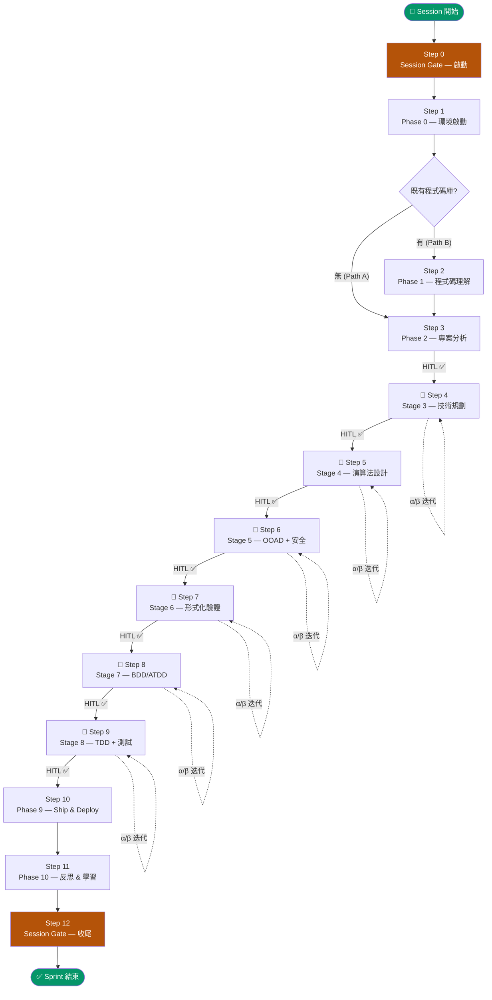

# AI Coding Workflow — Agentic Pipeline

> **Single Source of Truth** for LangGraph-based agentic development workflow orchestration.

本目錄實作一套以 **LangGraph** 驅動的 AI 開發管線，將 AGENTS.md 的 12-Step 協議具象化為可執行的 Python DAG。

---

## Repository Structure

```
ai_coding/
├── AGENTS.md                  # 統一執行協議：Step 0-12 + skill routing
├── README.md                  # 本文件（人類參考）
├── config.yaml                # 外部化 YAML 配置（模型、提示詞、圖拓樸）
├── pyproject.toml             # Python 依賴 + 測試配置
├── src/agentic_workflow/
│   ├── domain/                # 純 Python 業務邏輯（不依賴 LangGraph）
│   │   ├── algorithms/        # 25 個治理演算法（OO 類別）
│   │   ├── models/            # Pipeline, Stage, Enums
│   │   └── services/
│   ├── application/           # Use Cases、Port 介面
│   ├── adapters/
│   │   └── langgraph/         # 唯一知道 LangGraph 的層
│   │       ├── state_mapper.py    # WorkflowState TypedDict + 雙向轉換器
│   │       └── nodes.py           # DAG 節點函數
│   └── frameworks/
│       ├── graph.py           # OO Builder Classes（唯一建圖路徑，ADR-STR-007）
│       ├── config.py          # YAML 配置載入器
│       └── main.py            # CLI 入口點
├── docs/                      # 治理產出物
│   ├── workflow-state.md      # 狀態機持久化
│   ├── traceability-matrix.md # 追溯矩陣 + ADR 登記
│   └── risk-register.md       # 風險登錄表
└── skills/workflow-skills/    # 17 個可執行協議 (## Step N 格式)
```

---

## LangGraph 架構說明

### 1. 核心狀態：WorkflowState

所有節點共用一個 `TypedDict`，LangGraph 的 reducer 負責合併部分更新：

```python
class WorkflowState(TypedDict, total=False):
    pipeline_id: str           # 管線唯一識別碼
    pipeline_status: str       # "not_started" | "running" | "completed" | "failed"
    current_position: str      # "phase0" | "stage3" | ...
    last_gate_decision: str    # "pass" | "pass_with_warnings" | "fail"
    current_stage_id: str      # 當前 Stage ID
    stage_status: str          # "pending" | "iterating" | "passed"
    iteration_count: int       # α/β 迭代計數
    metadata: dict[str, Any]   # 任意中繼資料（驗證結果、completeness 等）
```

`total=False` → 節點只需回傳**有變化的欄位**，其餘保留。

### 2. 三層子圖架構

```
MasterGraphBuilder
  └─ IterationGraphBuilder      (stage_3 ~ stage_8 共用同一 compiled app)
       └─ MicroValidationGraphBuilder  (10 步線性驗證鏈)
```

#### MicroValidationGraphBuilder — 10 步微驗證鏈

```
s0_format → s1_id → s2_fwd → s3_bwd → s4_sem →
s5_orphan → s55_lateral → s57_lesson → s6_impact → s7_record → s8_warning → END
```

最後的 `s8_warning` 驗證 `pyproject.toml` 符合 ADR-GOV-026（零警告政策）。

#### IterationGraphBuilder — α/β 雙 Agent 迴圈

```
alpha ──[fixed_point?]──► beta → micro_val(subgraph) → rca
  ▲                                                      │
  └─────────────[hitl == "alpha"]───────────────────────┘
                [hitl == "pass"] → END
```

#### MasterGraphBuilder — 主管線

```
start → phase_0 → phase_1 → phase_2
      → stage_3 → stage_4 → stage_5 → stage_6 → stage_7 → stage_8
      → phase_9 → phase_10 → complete → END
```

`stage_3` 到 `stage_8` 共用同一個 `IterationGraphBuilder.build()` 物件。

### 3. 節點函數規則

每個節點的簽章固定為 `(WorkflowState) -> WorkflowState`，透過 `StateMapper` 與 domain 物件解耦：

```python
def node_start_pipeline(state: WorkflowState) -> WorkflowState:
    pipeline = StateMapper.state_to_pipeline(state)  # state → domain
    pipeline.start()                                  # 純 domain 邏輯
    return StateMapper.pipeline_to_state(pipeline)   # domain → state
```

Domain 層的 25 個演算法（`algorithms/`）完全不 import LangGraph。

### 4. 建圖方式（唯一路徑）

> **ADR-STR-007**: OO Builder 是唯一合法的建圖機制。YAML 動態建圖已被移除。
> 允許多條建圖路徑等同於允許 LLM 代理合法化地跳過治理步驟，屬於架構性危害。

```python
from agentic_workflow.frameworks.graph import build_graph

app = build_graph()  # → MasterGraphBuilder.build()
```

變更圖拓樸的唯一合法方式：修改 `frameworks/graph.py` 並建立對應 ADR。

---

## 安裝與 API Key 配置

### 安裝

```bash
# Python >= 3.12 必要
pip install -e ".[dev]"
```

### API Key 配置

本框架支援 Anthropic（Claude）和 OpenAI（GPT）。**絕對不要將 API Key 寫進 `config.yaml`**。

#### 方式一：環境變數（推薦）

```bash
# Windows PowerShell
$env:ANTHROPIC_API_KEY = "sk-ant-..."
$env:OPENAI_API_KEY    = "sk-..."

# Linux / macOS
export ANTHROPIC_API_KEY="sk-ant-..."
export OPENAI_API_KEY="sk-..."
```

#### 方式二：.env 檔案（搭配 python-dotenv）

建立 `.env`（已在 `.gitignore`）：

```dotenv
ANTHROPIC_API_KEY=sk-ant-...
OPENAI_API_KEY=sk-...
```

程式碼中載入：

```python
from dotenv import load_dotenv
load_dotenv()
```

#### 方式三：系統永久設定（Windows）

```powershell
[System.Environment]::SetEnvironmentVariable("ANTHROPIC_API_KEY", "sk-ant-...", "User")
[System.Environment]::SetEnvironmentVariable("OPENAI_API_KEY", "sk-...", "User")
```

### config.yaml 中的模型選擇

`config.yaml` 只宣告**模型名稱和參數**，API Key 由執行環境注入：

```yaml
models:
  reasoning:                        # 高複雜度推理任務 (Agent α/β)
    provider: "anthropic"           # → 使用 ANTHROPIC_API_KEY
    name: "claude-3-7-sonnet-20250219"
    temperature: 0.7
  editing:                          # 輕量修改任務 (微驗證節點)
    provider: "anthropic"           # → 使用 ANTHROPIC_API_KEY
    name: "claude-3-5-haiku-20241022"
    temperature: 0.1                # 低溫度 = 更確定性的輸出
  fallback:                         # 降級備援
    provider: "openai"              # → 使用 OPENAI_API_KEY
    name: "gpt-4o-mini"
    temperature: 0.0
```

---

## 執行管線

### 快速執行

```python
from agentic_workflow.frameworks.graph import build_graph

app = build_graph()

state = {
    "pipeline_id": "my-project-001",
    "pipeline_status": "not_started",
    "current_position": "phase0",
    "metadata": {
        "project_root": "/path/to/target-project",
        "recent_changed_ids": ["FR-001", "UC-002"],
        "recent_changes_content": "# 本次變更說明...",
    }
}

final_state = app.invoke(state)
print(final_state["pipeline_status"])   # "completed" or "failed"
print(final_state["metadata"])          # 含 completeness / validation 結果
```

### CLI 入口

```bash
python -m agentic_workflow.frameworks.main
```

---

## 自舉（Self-Bootstrap）

以此框架的管線分析框架本身（指向 `ai_coding/` 根目錄）：

```python
from agentic_workflow.frameworks.graph import build_graph

app = build_graph()  # ADR-STR-007: OO Builder 是唯一合法建圖路徑

state = {
    "pipeline_id": "self-bootstrap-v2",
    "pipeline_status": "not_started",
    "current_position": "phase0",
    "metadata": {
        "project_root": ".",           # 指向自身
        "recent_changed_ids": [],
        "recent_changes_content": "",
    }
}
result = app.invoke(state)
```

管線執行順序由 `MasterGraphBuilder` 硬性定義：

```
start → phase_0 → phase_1 → phase_2
      → stage_3 → stage_4 → stage_5 → stage_6 → stage_7 → stage_8
      → phase_9 → phase_10 → complete → END
```

`stage_3` 到 `stage_8` 每個均執行完整的 `IterationGraphBuilder`（α/β 迭代 + 10 步微驗證），不可省略。

---

## 測試

```bash
# 全套測試（646 tests，100% coverage）
python -m pytest tests/

# 只測 LangGraph 圖建構
python -m pytest tests/test_frameworks_graph.py tests/test_frameworks_graph_coverage.py -v

# 只測 OO Builder 圖建構
python -m pytest tests/test_frameworks_graph.py tests/test_frameworks_graph_coverage.py -v
```

---

## Workflow Pipeline 流程圖



---

## Key Architecture Decisions

| 決策 | 實作 | 依據 |
|------|------|------|
| Domain 完全不知道 LangGraph | `algorithms/` 只用純 Python | ADR-STR-002 |
| 節點只做狀態轉換 | `state_to_X → X.method() → X_to_state` | ADR-STR-003 |
| 子圖共用 | `iter_app` 同一物件掛在 stage_3~8 | ALG-001 |
| **單一建圖路徑** | OO Builder 是唯一合法建圖機制，YAML 拓樸已移除 | **ADR-STR-007** |
| YAML 僅限 models+prompts | `config.yaml` 不含圖拓樸 | ADR-STR-006 (amended) |
| 零警告強制 | `filterwarnings = ["error", ...]` | ADR-GOV-026 |
| OO 演算法類別 | 所有 algorithms 為 class，不用 module-level 函數 | ALG-010 |

---

## Key Files

| File | Purpose |
|------|---------|
| [AGENTS.md](./AGENTS.md) | 統一執行協議：Step 0-12 + skill routing |
| [config.yaml](./config.yaml) | 模型配置 + 提示詞範本（**不含**圖拓樸，見 ADR-STR-007） |
| [docs/adr/ADR-STR-007.md](./docs/adr/ADR-STR-007.md) | 單一建圖路徑決策紀錄 |
| [docs/traceability-matrix.md](./docs/traceability-matrix.md) | 追溯矩陣 + ADR 登記簿 |
| [docs/workflow-state.md](./docs/workflow-state.md) | 當前管線位置持久化 |
| `src/agentic_workflow/adapters/langgraph/nodes.py` | 所有 DAG 節點函數 |
| `src/agentic_workflow/frameworks/graph.py` | OO Graph Builder Classes（唯一建圖路徑） |
