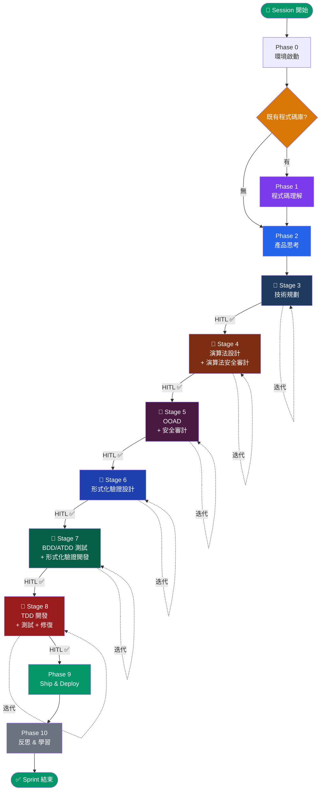
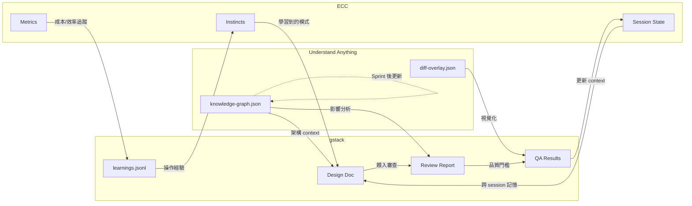

# Integrated Workflow Orchestration

> **ECC** × **gstack** × **Understand Anything** — 端對端流程編排

本文件定義了整合三個工具鏈的嚴謹開發流程。

- **Path A — Greenfield**：全新任務，無既有架構包袱
- **Path B — Existing Codebase**：需要先分析既有 repository 再執行任務

**核心流程為 6 階段序列式迭代管線**，每個階段皆為 `[雙 Agent 發散→收斂]` 迭代迴圈，
並在每次迭代內部及階段出口設置**人在迴路（HITL）驗證閘門**。

---

## 總覽流程圖



---

## Phase 0：環境啟動

> 每次 Session 開始時自動執行，不需手動介入。

### 自動觸發

| 工具 | 自動行為 | 說明 |
|------|---------|------|
| **ECC** | `SessionStart` hook | 載入前次 context、偵測 package manager、啟動觀察器 |
| **gstack** | SKILL.md Preamble | 版本檢查、session 追蹤、learnings 載入、GBrain 連接、artifacts sync |

### 首次使用引導（僅首次）

gstack 首次使用會依序詢問：
1. Boil the Lake 理念介紹
2. Telemetry 偏好（community / anonymous / off）
3. Proactive 建議開關
4. CLAUDE.md 路由規則注入
5. 寫作風格選擇

> [!TIP]
> 這些引導只出現一次，之後的 session 會直接跳過。

### 決策閘門：判斷路徑

```
Q: 是否有需要修改或理解的既有程式碼庫？

├─ 否 → Path A (Greenfield) → 直接進入 Phase 2
└─ 是 → Path B (Existing)   → 進入 Phase 1
```

---

## Phase 1：程式碼理解 ⟨Path B Only⟩

> **主角：Understand Anything**
> 在動手之前先徹底理解既有程式碼的架構、依賴關係和複雜度。

### 步驟 1.1：建立知識圖譜

```
/understand
```

| 條件 | 行為 |
|------|------|
| 首次分析（無 `knowledge-graph.json`） | 全量分析，5 個 agent pipeline |
| 圖譜存在但程式碼已變更 | 增量更新，僅分析變更檔案 |
| 圖譜存在且無變更 | 跳過，報告「已是最新」 |
| 需要強制重建 | `/understand --full` |

**產出：** `.understand-anything/knowledge-graph.json`

### 步驟 1.2：視覺化探索

```
/understand-dashboard
```

在瀏覽器中開啟互動式 Dashboard，查看：
- 架構分層（UI / API / Service / Data）
- 檔案/函式/類別的依賴關係圖
- 複雜度熱點
- 導覽路線（Tour）

### 步驟 1.3：針對性問答

```
/understand-chat <你的問題>
```

範例：
- `/understand-chat 認證流程是如何運作的？`
- `/understand-chat 資料庫 schema 在哪裡定義？`
- `/understand-chat 哪些模組依賴 payments service？`

### 步驟 1.4：深入特定元件（按需）

```
/understand-explain <路徑>
```

對需要深入了解的元件進行詳細解說，包括架構角色、內部結構、外部連接和資料流。

### 步驟 1.5：評估現有變更（若有 WIP 變更）

```
/understand-diff
```

如果 repo 上已有未提交的變更或正在進行的 feature branch，使用 diff 分析來理解：
- 哪些元件被修改
- 爆炸半徑（影響範圍）
- 跨層影響
- 風險評估

**產出：** `diff-overlay.json`（可在 Dashboard 上視覺化）

### Phase 1 產出物

| 產出 | 用途 |
|------|------|
| `knowledge-graph.json` | 程式碼庫結構化知識，供後續所有 Phase 參考 |
| Dashboard URL | 隨時可回來查閱的視覺化介面 |
| 理解筆記 | 記錄架構決策、技術債、複雜度熱點 |
| `diff-overlay.json`（可選） | 既有變更的影響分析 |

> [!IMPORTANT]
> Phase 1 的產出不只是一次性的——在 Phase 4 實作過程中，可以隨時回來用 `/understand-chat` 查詢，或用 `/understand-explain` 深入特定元件。

---

## Phase 2：產品思考

> **主角：gstack**
> 在寫任何程式碼之前，先想清楚要解決什麼問題。

### 步驟 2.1：產品腦暴（Office Hours）

```
/office-hours
```

gstack 會扮演 YC Office Hours 的角色：
1. 提出 6 個逼迫性問題（forcing questions），挖掘真正的需求
2. 挑戰你的前提假設
3. 重新定義問題框架
4. 提出 3 個實作方案與工作量估算
5. **產出：Design Doc**（自動餵入下游 skill）

### 步驟 2.2：策略驗證

```
/plan-ceo-review
```

以 CEO 視角審查 Design Doc，提供 4 種模式：
- **Expansion**：想更大
- **Selective Expansion**：局部擴展
- **Hold Scope**：維持範圍
- **Reduction**：縮減至 MVP

Phase 2 完成後，自動進入 **Stage 3（技術規劃）**，開始 6 階段迭代管線。

---

## 雙 Agent 迭代協議（通用定義）

> 以下 6 個 Stage 皆遵循此協議。每個 Stage 僅需定義自己的**審查維度**。

```
每個 Stage 內部的迭代迴圈：

   ┌──────────────────────────────────────────────┐
   │  Step A: Agent α（破綻發掘者）               │
   │  → 依該 Stage 的審查維度，窮盡式批判         │
   │  → 產出：問題清單 + 方向建議                 │
   ├──────────────────────────────────────────────┤
   │  Step B: Agent β（收斂整合者）               │
   │  → 對每個破綻執行決策流：                    │
   │    分類 → 奧卡姆剃刀 → 前提窮盡             │
   │    → 併吞分析 → 循環依賴破解 → 邊界內化     │
   │  → 產出：完整自包含改善文件                  │
   ├──────────────────────────────────────────────┤
   │  Step C: 👤 HITL 迭代閘門                    │
   │  → 使用者審查本輪摘要                        │
   │  → [1] 繼續迭代  [2] 加入新需求後繼續        │
   │  → [3] 通過 ✅ → 進入下一 Stage             │
   └──────────────────────────────────────────────┘

   不動點偵測：當 Agent α 僅剩 YAGNI 級質疑
   → 自動建議終止迭代

離開每個 Stage 前：HITL 出口閘門 ✅
```

---

## Stage 3：技術規劃

> **[雙 Agent 迭代]** 將產品思考轉化為可執行的技術計畫。

### 審查維度（Agent α）

| 代號 | 維度 | 核心問題 |
|------|------|---------|
| T1 | 架構可行性 | 技術方案是否能滿足所有需求？邊界情境？ |
| T2 | 規模與效能 | 資料量/並行/延遲是否被系統性考量？ |
| T3 | 安全威脅面 | 攻擊面是否被窮舉？STRIDE 是否完整？ |
| T4 | 測試策略 | 測試矩陣是否覆蓋所有分支？驗收標準是否明確？ |
| T5 | 技術債評估 | 是否引入不必要的耦合或捷徑？ |
| T6 | 依賴風險 | 第三方依賴的穩定性、授權、維護狀態？ |
| T7 | 範圍鎖定 | scope 是否精確？是否有隱性 scope creep？ |

### 整合既有工具

```
/autoplan                  # gstack 自動全套審查 (CEO→Design→Eng→DX)
/plan-eng-review           # 架構圖、資料流、edge case、測試矩陣
/plan-design-review        # 設計維度 0-10 評分
/plan-devex-review         # DX 審查（若開發 API/SDK/CLI）
```

> [!TIP]
> gstack 的 `/autoplan` 產出物直接作為 Agent α 的審查輸入。Agent α 在 gstack 審查的基礎上進行更深層的窮盡式質疑。

### Stage 3 產出物

| 產出 | 來源 |
|------|------|
| 技術架構圖（ASCII） | `/plan-eng-review` + Agent β 精煉 |
| 測試矩陣 | `/plan-eng-review` |
| 設計評分報告 | `/plan-design-review` |
| 迭代決策日誌 | Agent α/β 迭代記錄 |

### HITL 出口閘門

- [ ] 架構方案已批准
- [ ] 測試策略已定義
- [ ] 安全考量已識別
- [ ] 實作範圍已鎖定
- [ ] 使用者確認 ✅ → 進入 Stage 4

---

## Stage 4：演算法設計 → 演算法層級安全審計

> **[雙 Agent 迭代]** 包含兩個序列子步驟，在同一個迭代迴圈中執行。

### 子步驟 4a：演算法設計

#### 審查維度（Agent α）— 22 維（A-V）

| 代號 | 維度 | 代號 | 維度 |
|------|------|------|------|
| A | 風險忠實度 | L | 不變量靜態檢查 |
| B | 響應延遲最佳化 | M | 分布假設稽核 |
| C | 啟發式窮舉與升級 | N | 冗餘與失效項清除 |
| D | 理論保證升級（非🅐⁺→🅐⁺） | O | Pseudo code 處理 |
| E | 錨定參數資料驅動化 | P | 統計方法升級候選 |
| F | 邊界系統性檢查 | Q | 寫死常數推導 |
| G | 循環依賴 | R | 章節結構審查 |
| H | 穩態收斂 | S | 併吞分析 |
| I | 圖靈可計算性 | T | 風險再證明 |
| J | 職責正交性 | U | 流程性事件時點 |
| K | 拆離點與耦合 | V | 典範轉移審查 |

#### Agent β 收斂心法

- **絕對最佳優先**：能升🅐⁺就升
- 加速技術：Minimax 下界(→🅐)、Variance Reduction(🅒→🅑)、K-FAC/Shampoo、Polyak-Ruppert Averaging
- **禁止 fallback / 條件旁路**（數學彙整除外）
- **暫禁降為🅓**
- 每張理論保證表必須加新欄位說明加速/逼近技術

### 子步驟 4b：演算法層級安全審計

在演算法設計達不動點後，於同一迭代迴圈內執行安全審計：

```bash
# SkillFortify 供應鏈掃描（若演算法引入外部依賴）
skillfortify scan . --severity-threshold high
skillfortify trust <algorithm-module>
```

| 審計維度 | 檢查項 |
|---------|--------|
| 數值安全 | 溢位、精度損失、NaN 傳播 |
| 輸入邊界 | 對抗性輸入是否被系統性處理？ |
| 隨機性安全 | CSPRNG 使用是否正確？種子管理？ |
| 供應鏈 | 演算法依賴的數學庫是否經 SkillFortify 驗證？ |

### HITL 出口閘門

- [ ] 所有理論保證達目標等級
- [ ] 所有啟發式已被識別並標記
- [ ] 安全審計無 HIGH+ 發現
- [ ] 使用者確認 ✅ → 進入 Stage 5

---

## Stage 5：物件導向設計 → 安全審計

> **[雙 Agent 迭代]** 將演算法規格轉化為 OOAD 類別圖，然後執行架構層安全審計。

### 子步驟 5a：OOAD 設計

#### 審查維度（Agent α）— 4 維

| 代號 | 維度 | 核心問題 |
|------|------|---------|
| OA | GRASP 責任分配 | Information Expert / Creator / Coupling / Cohesion 是否正確？ |
| OB | GoF 必要性證偽 | 有罪推定——每個設計模式真的需要嗎？Strategy 是否只需 Lambda？ |
| OC | 封裝漏洞 | 集合暴露？不變量可繞過？非法狀態可建構？ |
| OD | UML 語意與依賴 | 組合/聚合精確嗎？循環依賴？LSP 違反？繼承可替換為組合？ |

#### Agent β 收斂心法

- **最小完備抽象**：無法再拔除任何介面而不破壞 OCP，也無法再新增任何介面而不違反 YAGNI
- **充血模型優先**：將 Service/Manager 邏輯強制收斂回 Domain Classes
- **如無必要，勿增實體**：勇敢降級設計模式
- **依賴方向是靈魂**：箭頭指向核心、指向穩定

#### 產出格式

PlantUML Design Class Diagram，必須：
- 標示 `<<interface>>`、`<<abstract>>`、可見性（`+`, `-`, `#`）
- 嚴格使用正確 UML 關係箭頭（`<|--` 繼承、`<|..` 實現、`*--` 組合、`o--` 聚合）
- 大量使用 `note` 標注 GRASP/SOLID 設計意圖

### 子步驟 5b：安全審計

```bash
# Layer 1: 應用安全
/cso                                      # gstack OWASP/STRIDE

# Layer 2: Agent 安全
npx ecc-agentshield scan --opus --stream  # ECC 紅藍隊審計

# Layer 3: 供應鏈安全
skillfortify scan . --format json         # 形式化供應鏈驗證
skillfortify sbom . --format cyclonedx    # ASBOM 生成
skillfortify lock . --output skill-lock.json
```

三層縱深防禦皆須通過，任一層 HIGH+ 發現 → 回到子步驟 5a 修改設計。

### HITL 出口閘門

- [ ] UML 類別圖達最小完備抽象
- [ ] Agent α 僅剩 YAGNI 級質疑
- [ ] 三層安全審計全部 PASS
- [ ] SkillFortify 信任等級 ≥ COMMUNITY_VERIFIED
- [ ] 使用者確認 ✅ → 進入 Stage 6

---

## Stage 6：形式化驗證設計

> **[雙 Agent 迭代]** 為關鍵元件設計形式化驗證規格。

### 審查維度（Agent α）

| 代號 | 維度 | 核心問題 |
|------|------|---------|
| F1 | 不變量完備性 | 是否窮盡所有系統不變量？遺漏了哪些？ |
| F2 | 前置/後置條件 | 每個公開方法的 contract 是否嚴謹？ |
| F3 | 狀態機正確性 | 狀態轉移是否窮盡？不可能的狀態組合是否被排除？ |
| F4 | 活性與終止性 | 是否保證進度（liveness）？迴圈是否終止？ |
| F5 | 並行安全 | 共享資源是否有 data race？鎖序是否一致（deadlock-free）？ |
| F6 | 型別安全 | 是否可用型別系統編碼更多不變量（Phantom Types, Newtype）？ |

#### Agent β 收斂心法

- 驗證規格必須**可執行**（Property-based testing 或 Model checking 可用）
- 優先使用**型別系統編碼**不變量（compile-time > runtime）
- 形式化規格不得引入實作細節

### Stage 6 產出物

| 產出 | 說明 |
|------|------|
| 不變量總表 | 所有系統不變量的形式化定義 |
| Contract 規格 | 每個公開 API 的前置/後置/不變量 |
| 狀態機圖 | Mermaid stateDiagram 或等效表達 |
| 驗證策略 | 哪些用 Property-based testing、哪些用 Model checking |

### HITL 出口閘門

- [ ] 不變量覆蓋所有關鍵路徑
- [ ] Contract 規格可直接轉為測試
- [ ] 並行安全問題已系統性處理
- [ ] 使用者確認 ✅ → 進入 Stage 7

---

## Stage 7：BDD/ATDD 測試開發 → 形式化驗證開發

> **[雙 Agent 迭代]** 先寫驗收條件與測試，再寫形式化驗證程式碼。

### 子步驟 7a：BDD 整合自動化測試 / ATDD 驗收測試開發

#### 審查維度（Agent α）

| 代號 | 維度 | 核心問題 |
|------|------|---------|
| B1 | 場景覆蓋率 | Given/When/Then 是否覆蓋所有 Stage 4 的理論保證？ |
| B2 | 邊界場景 | 退化情境（空輸入、極值、溢位）是否被測試？ |
| B3 | 驗收標準對齊 | 每個 BDD 場景是否可追溯回 Stage 3 的需求？ |
| B4 | 測試獨立性 | 測試之間是否有隱性依賴或順序耦合？ |
| B5 | 可讀性 | 非技術人員是否能讀懂 BDD 場景？ |

### 子步驟 7b：形式化驗證開發

#### 審查維度（Agent α）

| 代號 | 維度 | 核心問題 |
|------|------|---------|
| V1 | Stage 6 規格覆蓋 | 每個不變量和 Contract 是否有對應的驗證程式碼？ |
| V2 | Property-based 涵蓋 | 是否為每個啟發式設計了隨機化 property test？ |
| V3 | 反例追蹤 | 發現的反例是否被系統性追蹤並轉為回歸測試？ |
| V4 | 邊界值分析 | 參數邊界是否被 property generators 涵蓋？ |

### 自動保障（ECC Hooks 在此 Stage 開始啟動）

| Hook | 作用 |
|------|------|
| `pre:edit-write:gateguard-fact-force` | 首次編輯測試檔案前強制先調查 |
| `post:quality-gate` | 每次檔案編輯後品質檢查 |
| `post:edit:console-warn` | console.log 警告 |
| `post:ecc-context-monitor` | Context/成本/範圍監控 |

### HITL 出口閘門

- [ ] BDD 場景覆蓋所有需求與理論保證
- [ ] 形式化驗證程式碼覆蓋 Stage 6 所有 Contract
- [ ] 所有 property tests 通過（或反例已轉為 issue）
- [ ] 使用者確認 ✅ → 進入 Stage 8

---

## Stage 8：TDD 開發 → 執行自動化測試 → 調查修復

> **[雙 Agent 迭代]** 紅-綠-重構循環 + 自動化測試執行 + 失敗調查修復。

### 子步驟 8a：TDD 開發

#### 審查維度（Agent α）

| 代號 | 維度 | 核心問題 |
|------|------|---------|
| D1 | 紅-綠-重構紀律 | 是否先寫失敗測試，再寫最少程式碼通過？ |
| D2 | OOAD 一致性 | 實作是否忠實於 Stage 5 的類別圖？偏離處是否有理由？ |
| D3 | 演算法一致性 | 實作是否忠實於 Stage 4 的演算法規格？ |
| D4 | 防禦性程式設計 | 邊界檢查、null safety、error handling 是否系統性？ |
| D5 | 可測試性 | 是否有不可測試的程式碼？依賴注入是否到位？ |

### 全程自動保障（ECC Hooks）

| Hook | 觸發時機 | 作用 |
|------|---------|------|
| `pre:bash:dispatcher` | 每次 Bash 執行前 | 品質/tmux/push 檢查 |
| `pre:edit-write:gateguard-fact-force` | 首次編輯某檔案 | 強制先調查再修改 |
| `pre:config-protection` | 編輯 linter 配置 | 阻止弱化配置 |
| `post:quality-gate` | 每次編輯後 | 品質門檻檢查 |
| `post:edit:design-quality-check` | 前端編輯後 | AI slop 偵測 |
| `post:edit:console-warn` | 編輯後 | console.log 警告 |
| `post:ecc-context-monitor` | 每次工具使用後 | Context/成本/範圍監控 |
| `stop:format-typecheck` | 回應結束 | 批次格式化 + 類型檢查 |
| `stop:check-console-log` | 回應結束 | console.log 掃描 |
| `stop:evaluate-session` | 回應結束 | 萃取可複用模式 |

gstack 持續 Checkpoint（可選）：

```bash
gstack-config set checkpoint_mode continuous   # 自動 WIP commit
```

Path B 專屬 — 增量更新知識圖譜：

```
/understand   # 大量修改後，增量更新知識圖譜
```

### 子步驟 8b：執行自動化測試

```bash
# 執行 Stage 7 寫的 BDD/ATDD 測試
# 執行 Stage 7 寫的 Property-based 測試
# 執行 TDD 單元測試
```

```
/qa https://your-staging-url.com     # gstack 瀏覽器 QA 測試
/qa-only https://your-staging-url.com # 僅報告不修復
/review                               # gstack 程式碼審查
/codex                                # 跨模型第二意見（可選）
/design-review                        # 設計審查（前端）
/devex-review                         # DX 審查（API/SDK）
```

### 子步驟 8c：調查修復

測試失敗時，進入調查修復迴圈：

```
/investigate    # gstack 調查模式
```

- 自動凍結編輯範圍（`/freeze`），防止意外修改無關程式碼
- 鐵律：**先調查，再修復**
- 追蹤資料流、測試假設
- 3 次修復失敗後自動上報
- 修復後自動解凍（`/unfreeze`）
- 修復後回到子步驟 8b 重新執行測試

### 最終安全審計（Ship 前最後防線）

```bash
# Layer 1: 應用安全
/cso

# Layer 2: Agent 安全
npx ecc-agentshield scan --opus --stream

# Layer 3: 供應鏈安全
skillfortify scan . --format json --severity-threshold high
skillfortify lock . --output skill-lock.json
skillfortify sbom . --format cyclonedx
skillfortify dashboard --output security-report.html
```

### HITL 出口閘門

- [ ] 所有 TDD 單元測試通過
- [ ] 所有 BDD/ATDD 驗收測試通過
- [ ] 所有 Property-based 測試通過
- [ ] `/review` 程式碼審查通過
- [ ] `/qa` 瀏覽器 QA 通過（若有 UI）
- [ ] 三層安全審計全部 PASS
- [ ] SkillFortify 信任等級 ≥ COMMUNITY_VERIFIED
- [ ] 使用者確認 ✅ → 進入 Phase 9

---

## Phase 9：Ship & Deploy

> **主角：gstack**

### 步驟 9.1：Ship

```
/ship
```

- 同步 main branch
- 執行完整測試套件
- 審計測試覆蓋率
- Push 並開啟 PR
- 如果沒有測試框架，會自動 bootstrap 一個
- 自動壓縮 WIP commits（保留非 WIP commits）

### 步驟 9.2：Merge + Deploy + 驗證

```
/land-and-deploy
```

一鍵從「approved」到「verified in production」：
- Merge PR
- 等待 CI 和部署
- 驗證生產環境健康

### 步驟 9.3：Post-Deploy 監控

```
/canary
```

部署後持續監控：
- Console 錯誤
- 效能回歸
- 頁面失敗

### 步驟 9.4：更新文件

```
/document-release
```

自動讀取所有文件檔案，對照 diff，更新所有過時的內容。

---

## Phase 10：反思 & 學習

> **三個工具共同參與**，確保知識和經驗得到保存。

### 10.1 Retrospective（gstack）

```
/retro
```

- 每人每週工作分析
- Shipping 連續記錄
- 測試健康趨勢
- 成長機會

跨專案全域 retro：

```
/retro global
```

### 10.2 知識圖譜更新（Understand Anything）

```
/understand
```

Sprint 結束後執行增量更新，確保知識圖譜反映最新的程式碼變更。如果是全新專案（Path A），這是首次建立知識圖譜的時機。

### 10.3 持續學習（ECC）

ECC 的 `stop:evaluate-session` hook 會自動在每次回應結束時萃取模式。手動操作：

```
/instinct-status        # 查看學到的 instincts
/evolve                 # 將相關 instincts 聚類為新的 skill
/instinct-export        # 匯出分享
```

### 10.4 操作經驗記錄（gstack）

gstack 會在每個 skill 結束時自動記錄操作經驗到 `learnings.jsonl`。手動管理：

```
/learn                  # 查看、搜尋、修剪學習記錄
```

### 10.5 跨機器同步（gstack，可選）

```
gstack-brain-sync       # 同步 artifacts 到私有 Git repo
/sync-gbrain            # 重新索引程式碼到 GBrain
```

---

## 快速參考卡

### 6 階段迭代管線（完整路徑）

```
Phase 0   [自動] ECC SessionStart + gstack Preamble
Phase 1   /understand (Path B only)
Phase 2   /office-hours → /plan-ceo-review
─── 迭代管線開始 ───
Stage 3   [技術規劃]          /autoplan + 雙Agent迭代 → HITL ✅
Stage 4   [演算法+安全審計]    22維審查 + skillfortify  → HITL ✅
Stage 5   [OOAD+安全審計]      4維審查 + 三層安全審計   → HITL ✅
Stage 6   [形式化驗證設計]     不變量/Contract/狀態機   → HITL ✅
Stage 7   [BDD/ATDD+驗證開發]  場景覆蓋+Property test  → HITL ✅
Stage 8   [TDD+測試+修復]      紅綠重構+/review+/qa    → HITL ✅
─── 迭代管線結束 ───
Phase 9   /ship → /land-and-deploy → /canary
Phase 10  /retro → /understand → /evolve
```

### 精簡路徑（小型任務）

```
Phase 0   [自動]
Phase 1   /understand (若有既有 codebase)
Phase 2   /office-hours
Stage 3   [技術規劃] → HITL ✅
Stage 8   [TDD+測試+修復] → HITL ✅  (跳過 Stage 4-7)
Phase 9   /ship
Phase 10  /retro
```

---

## 工具責任矩陣

| Phase | Understand Anything | gstack | ECC | SkillFortify |
|-------|:------------------:|:------:|:---:|:----------:|
| **Phase 0: 環境啟動** | — | Preamble | SessionStart hook | — |
| **Phase 1: 程式碼理解** | ★ 主角 | — | — | — |
| **Phase 2: 產品思考** | 提供 context | ★ 主角 | 背景監控 | — |
| **Stage 3: 技術規劃** | 提供 context | ★ 主角 | 背景監控 | — |
| **Stage 4: 演算法+安全** | — | — | — | 演算法層供應鏈掃描 |
| **Stage 5: OOAD+安全** | — | — | — | OOAD 層供應鏈掃描 |
| **Stage 6: 形式化驗證** | — | — | — | — |
| **Stage 7: BDD/ATDD** | — | — | Hooks 品質 | — |
| **Stage 8: TDD+測試** | 增量更新 | Checkpoint | ★ Hooks 品質 | — |
| **三層安全審計 (Stage 5, 8)** | — | ★ /cso | AgentShield | ★ 形式化供應鏈驗證 |
| **Phase 9: Ship** | — | ★ 主角 | — | Lockfile 生成 |
| **Phase 10: 學習** | 圖譜更新 | Retro + Learnings | Instinct 演化 | ASBOM 存檔 |

---

## 資料流圖



---

## 並行 Sprint 模式（進階）

搭配 [Conductor](https://conductor.build) 可以同時執行 10-15 個 Sprint：

```
Sprint 1: /office-hours on Feature A
Sprint 2: /review on Branch B
Sprint 3: /qa on Staging C
Sprint 4: /understand on New Repo D
Sprint 5: /investigate on Bug E
...
```

每個 Sprint 獨立遵循本文件的流程。Sprint 之間透過 gstack 的 `learnings.jsonl` 和 ECC 的 `instincts` 共享學習成果。

---

## 安裝前提

```bash
# 1. 確保四個 submodule 已初始化
git submodule update --init --recursive

# 2. 安裝 gstack
cd skills/gstack && ./setup

# 3. 安裝 ECC (擇一)
# Plugin 路徑：
/plugin marketplace add https://github.com/affaan-m/everything-claude-code
/plugin install ecc@ecc
# 或手動路徑：
cd skills/everything-claude-code && npm install && ./install.sh --profile core

# 4. 安裝 Understand Anything
/plugin marketplace add Lum1104/Understand-Anything
/plugin install understand-anything

# 5. 安裝 SkillFortify（供應鏈安全掃描）
pip install skillfortify          # 核心掃描器
pip install skillfortify[all]     # 含 registry 掃描
```
