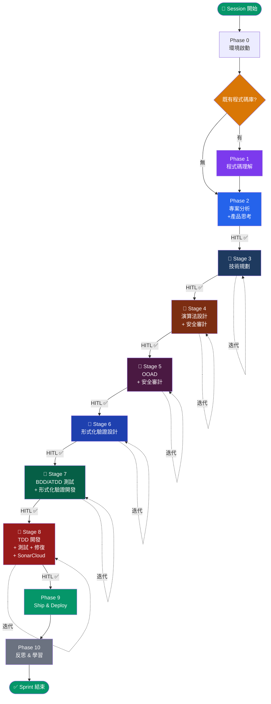

# Integrated Workflow Orchestration

> **ECC** × **gstack** × **Understand Anything** × **SkillFortify** — 端對端流程編排
>
> 本文件為頂層指揮器。每個階段的完整定義在 `docs/` 下對應文件中。
> **無簡化路徑**：所有專案、所有任務皆執行完整管線。

---

## 核心原則

1. **文件驅動**：所有產出物記錄至 `docs/` 資料夾
2. **ID 系統強制**：所有產出物指派追溯 ID（見 `docs/governance/TRACEABILITY.md`）
3. **左移微驗證**：每次檔案寫入（CREATE/MODIFY/FIX）後立即執行 8 步驗證迴圈
4. **影響分析強制**：每次修改自主執行影響分析（見 `docs/governance/IMPACT-ANALYSIS.md`）
5. **雙 Agent 迭代**：Stage 3-8 皆使用 Agent α/β 發散-收斂迴圈
6. **HITL 閘門**：每個 Stage 出口皆需人在迴路確認
7. **變更管理**：每次寫入皆為變更，FIX 類型強制根因左移（見 `docs/governance/CHANGE-MANAGEMENT.md`）

---

## 總覽流程圖



---

## 呼叫鏈層次結構

```
WORKFLOW.md (本文件 — 頂層指揮器)
│
├── docs/phases/phase-0-environment.md
├── docs/phases/phase-1-code-understanding.md
├── docs/phases/phase-2-project-analysis.md       ← 4 步驟
│   ├── skills: s2c-charter, s2c-stakeholder, s2c-scope-redteam
│   └── tools: /office-hours, /plan-ceo-review
│
├── docs/stages/stage-3-technical-planning.md      ← 7 維審查
│   ├── skills: iter-loop, micro-validation, impact-analysis-exec, s2c-requirements
│   └── tools: /autoplan, /plan-eng-review, /plan-design-review
├── docs/stages/stage-4-algorithm-design.md        ← 22 維審查
│   ├── skills: iter-loop, micro-validation, impact-analysis-exec
│   └── tools: skillfortify scan
├── docs/stages/stage-5-ooad-security.md           ← 4 維審查
│   ├── skills: iter-loop, micro-validation, impact-analysis-exec, s2c-domain-model, security-audit-3layer
│   └── tools: /cso, AgentShield, skillfortify
├── docs/stages/stage-6-formal-verification.md     ← 6 維審查
│   ├── skills: iter-loop, micro-validation, impact-analysis-exec
│   └── tools: (none external)
├── docs/stages/stage-7-bdd-atdd.md                ← 9 維審查
│   ├── skills: iter-loop, micro-validation, impact-analysis-exec, s2c-bdd-scenarios
│   └── tools: tdd-workflow skill, ECC hooks
├── docs/stages/stage-8-tdd-test-fix.md            ← 5 維審查
│   ├── skills: iter-loop, micro-validation, impact-analysis-exec, sonarcloud-gate, security-audit-3layer, tech-debt-collect
│   └── tools: /qa, /review, /investigate
│
├── docs/phases/phase-9-ship-deploy.md
│   ├── skills: completion-check
│   └── tools: /ship, /land-and-deploy, /canary
├── docs/phases/phase-10-reflect-learn.md
│   ├── skills: tech-debt-collect
│   └── tools: /retro, /understand, /evolve
│
├── docs/governance/ (跨切面，所有 Stage 皆引用)
│   ├── TRACEABILITY.md          ← ID 系統規格
│   ├── IMPACT-ANALYSIS.md       ← 影響分析規則
│   └── TECH-DEBT.md             ← 技術債範本
│
├── skills/workflow-skills/ (可執行協議，從 docs 獨立)
│   ├── iter-loop.md             ← 通用雙 Agent 迭代迴圈
│   ├── micro-validation.md      ← 左移微驗證迴圈
│   ├── impact-analysis-exec.md  ← 影響分析執行協議
│   ├── s2c-charter.md           ← S2C 專案章程生成
│   ├── s2c-stakeholder.md       ← S2C 利害關係人分析
│   ├── s2c-scope-redteam.md     ← S2C 範圍定義 + Red Team
│   ├── s2c-requirements.md      ← S2C 需求分解
│   ├── s2c-domain-model.md      ← S2C DDD 領域建模
│   ├── s2c-bdd-scenarios.md     ← S2C BDD 場景生成
│   ├── security-audit-3layer.md ← 三層安全審計
│   ├── sonarcloud-gate.md       ← SonarCloud 品質閘門
│   ├── completion-check.md      ← 預發布完成檢查
│   └── tech-debt-collect.md     ← 技術債收集 + RICE
│
└── docs/ (自舉產出 — 本專案的文件驅動內容)
    ├── project-charter.md       ← BG-001..BG-004
    ├── stakeholder-analysis.md  ← S-001..S-003
    ├── scope-definition.md      ← FEA-001..FEA-009
    └── traceability-matrix.md   ← Phase 2 追溯矩陣
```

---

## 雙 Agent 迭代協議（通用定義）

> 以下 6 個 Stage 皆遵循此協議。每個 Stage 僅需定義自己的**審查維度**。
> 完整迭代定義在各 Stage 文件中。

```
每個 Stage 內部的迭代迴圈：

   ┌──────────────────────────────────────────────┐
   │  Step A: Agent α（破綻發掘者）               │
   │  → 依該 Stage 的審查維度，窮盡式批判         │
   │  → 產出：問題清單 + 方向建議                 │
   ├──────────────────────────────────────────────┤
   │  Step B: Agent β（收斂整合者）               │
   │  → 對每個破綻執行決策流：                    │
   │    分類 → 奧卡姆剃刀 → 前提窮盡             │
   │    → 併吞分析 → 循環依賴破解 → 邊界內化     │
   │  → 產出：完整自包含改善文件                  │
   ├──────────────────────────────────────────────┤
   │  Step M: 微驗證迴圈（每個改善後立即執行）    │
   │  → 執行 TRACEABILITY.md 微動作驗證           │
   │  → 執行 IMPACT-ANALYSIS.md 影響分析          │
   │  → 全數通過才進入 Step C                     │
   ├──────────────────────────────────────────────┤
   │  Step C: 👤 HITL 迭代閘門                    │
   │  → 使用者審查本輪摘要                        │
   │  → [1] 繼續迭代  [2] 加入新需求後繼續        │
   │  → [3] 通過 ✅ → 進入出口閘門驗證           │
   └──────────────────────────────────────────────┘

   出口閘門 = 原有檢查 + 追溯矩陣驗證（見各 Stage 文件）

   不動點偵測：當 Agent α 僅剩 YAGNI 級質疑
   → 自動建議終止迭代
```

---

## ID 系統概要

> 完整規格見 `docs/governance/TRACEABILITY.md`

| 前綴 | 領域 | 指派階段 |
|------|------|---------|
| `BG-xxx` | 商業目標 | Phase 2.0 |
| `S-xxx` | 利害關係人 | Phase 2.1 |
| `FEA-xxx` | 功能特性 | Phase 2.2 |
| `FR-xxx` | 功能需求 | Stage 3 |
| `NFR-xxx` | 非功能需求 | Stage 3 |
| `UC-xxx` | 使用案例 | Stage 3 |
| `ADR-xxx` | 架構決策 | Stage 3 |
| `ALG-xxx` | 演算法規格 | Stage 4 |
| `CLS-xxx` | 類別/聚合 | Stage 5 |
| `EVT-xxx` | 領域事件 | Stage 5 |
| `INV-xxx` | 不變量 | Stage 6 |
| `SC-xxx` | BDD 場景 | Stage 7 |
| `TC-xxx` | 測試案例 | Stage 7/8 |
| `DEBT-xxx` | 技術債 | Phase 10 |
| `RISK-xxx` | 風險 | 任意 |
| `IMP-xxx` | 影響分析 | 任意 |

**追溯鏈**：`BG → FEA → FR → UC → SC → TC`（正向）/ 反向相同路徑

---

## 安全審計三層縱深

所有 Stage 5 和 Stage 8 的安全審計需通過三層：

| Layer | 工具 | 焦點 |
|-------|------|------|
| Layer 1: 應用安全 | `/cso` (gstack) | OWASP Top 10 + STRIDE |
| Layer 2: Agent 安全 | `npx ecc-agentshield scan --opus --stream` | 紅藍隊 AI 審計 |
| Layer 3: 供應鏈安全 | `skillfortify scan . --format json` | 形式化供應鏈驗證 |

---

## 工具責任矩陣

| Phase/Stage | UA | gstack | ECC | SkillFortify | 治理層 |
|-------------|:--:|:------:|:---:|:----------:|:------:|
| **Phase 0** | — | Preamble | SessionStart | — | — |
| **Phase 1** | ★ | — | — | — | — |
| **Phase 2** | context | ★ | 監控 | — | ID 指派 |
| **Stage 3** | context | ★ | 監控 | — | ID + 追溯 |
| **Stage 4** | — | — | — | 掃描 | ID + 追溯 |
| **Stage 5** | — | ★ /cso | AgentShield | ★ 供應鏈 | ID + 追溯 |
| **Stage 6** | — | — | — | — | ID + 追溯 |
| **Stage 7** | — | — | Hooks | — | ID + 追溯 |
| **Stage 8** | 增量 | Checkpoint | ★ Hooks | — | ID + 追溯 + SonarCloud |
| **安全審計** | — | ★ /cso | AgentShield | ★ 供應鏈 | 影響分析 |
| **Phase 9** | — | ★ | — | Lockfile | 完成檢查 |
| **Phase 10** | 圖譜 | Retro | Instinct | ASBOM | 技術債 |

---

## 完整管線快速參考

```
Phase 0   [自動] ECC SessionStart + gstack Preamble
Phase 1   /understand (Path B: 既有 codebase)
Phase 2   專案章程 → /office-hours → 範圍定義 → /plan-ceo-review   → HITL ✅
─── 迭代管線開始 ───
Stage 3   [技術規劃]          /autoplan + 7維 + 雙Agent迭代         → HITL ✅
Stage 4   [演算法+安全審計]    22維審查 + skillfortify              → HITL ✅
Stage 5   [OOAD+安全審計]      4維審查 + DDD + 三層安全審計         → HITL ✅
Stage 6   [形式化驗證設計]     6維 + 不變量/Contract/狀態機         → HITL ✅
Stage 7   [BDD/ATDD+驗證開發]  9維 + 場景覆蓋 + Property test      → HITL ✅
Stage 8   [TDD+測試+修復]      5維 + SonarCloud + /review + /qa    → HITL ✅
─── 迭代管線結束 ───
Phase 9   /ship → /land-and-deploy → /canary → /document-release
Phase 10  /retro → 技術債更新 → /understand → /evolve
```

**每個 Stage 的迭代迴圈**：Agent α → Agent β → 微驗證 → HITL
**跨切面治理**：TRACEABILITY.md + IMPACT-ANALYSIS.md + TECH-DEBT.md

---

## docs/ 資料夾結構

```
docs/
├── governance/
│   ├── TRACEABILITY.md          # ID 系統 + 微驗證協議
│   ├── IMPACT-ANALYSIS.md       # 強制影響分析閘門
│   └── TECH-DEBT.md             # 技術債登記冊範本
├── phases/
│   ├── phase-0-environment.md
│   ├── phase-1-code-understanding.md
│   ├── phase-2-project-analysis.md
│   ├── phase-9-ship-deploy.md
│   └── phase-10-reflect-learn.md
└── stages/
    ├── stage-3-technical-planning.md
    ├── stage-4-algorithm-design.md
    ├── stage-5-ooad-security.md
    ├── stage-6-formal-verification.md
    ├── stage-7-bdd-atdd.md
    └── stage-8-tdd-test-fix.md
```

---

## 安裝前提

```bash
# 1. 確保四個 submodule 已初始化
git submodule update --init --recursive

# 2. 安裝 gstack
cd skills/gstack && ./setup

# 3. 安裝 ECC (擇一)
/plugin marketplace add https://github.com/affaan-m/everything-claude-code
/plugin install ecc@ecc
# 或手動：
cd skills/everything-claude-code && npm install && ./install.sh --profile core

# 4. 安裝 Understand Anything
/plugin marketplace add Lum1104/Understand-Anything
/plugin install understand-anything

# 5. 安裝 SkillFortify
pip install skillfortify          # 核心掃描器
pip install skillfortify[all]     # 含 registry 掃描
```
