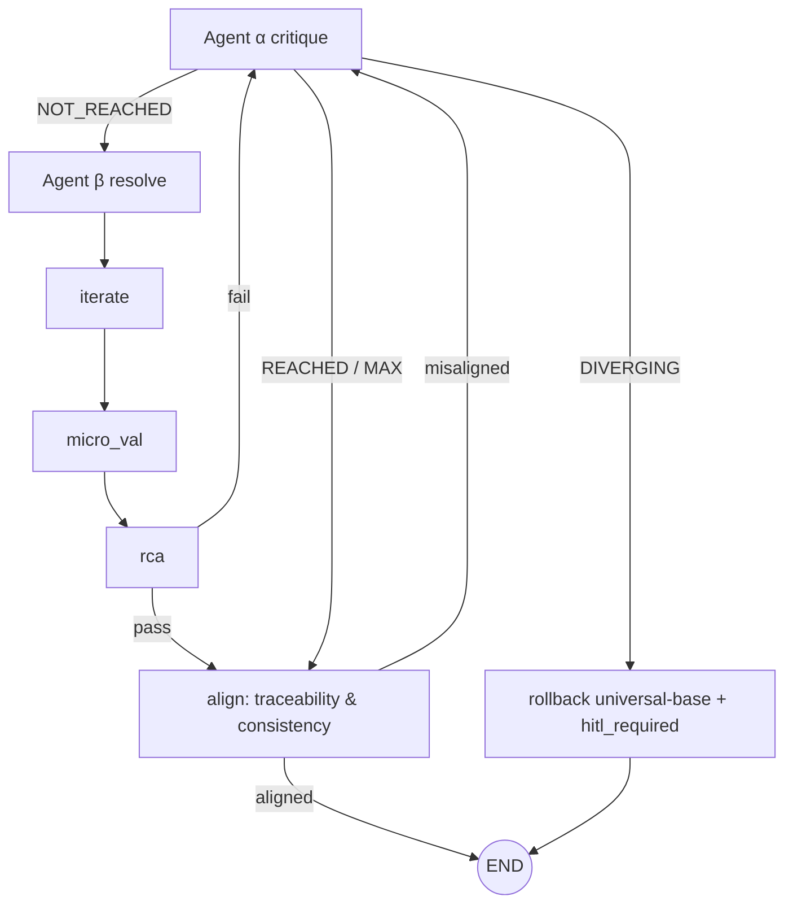
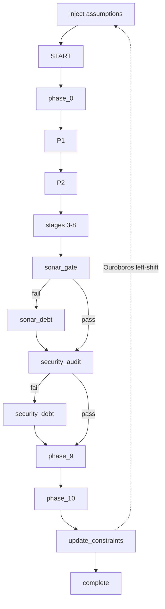

# ADR-STR-029: Autonomous Pipeline v2 — 動態債務迴圈、延遲 HITL、退化路徑與 Ouroboros 閉環

## 狀態
Accepted (2026-07-06)

## 背景
kanban TODO 收錄之流程重構提案指出，既有管線殘留「遇錯即擋」思維：

1. `HITL 3`~`HITL 9` 在每個 Stage 之間設硬性閘門，違反連續性原則（無 fallback 的 runtime 條件旁路應消除）。
2. `security_audit` 與 `sonar_gate` 是線性檢查點：FAIL 直接阻斷流程。
3. `ConvergenceDetector` 判定 DIVERGING 後竟 auto-pass 繼續前進（ADR-STR-003 的過度延伸），意圖飄移可污染下游。
4. Phase 10 Retro 產出走向 END SESSION，經驗未回注下一次啟動。

## 決策

依「效率—正確性分離」與控制理論回饋機制，實作四項核心重構：

### 1. 動態債務迴圈（Debt Accumulator, FR-068, ALG-016）
- `sonar_gate` / `security_audit` 的 FAIL 不再阻斷主流程。Master graph 以 `route_debt` 條件邊將 FAIL 導入 `sonar_debt` / `security_debt` 節點（`node_absorb_debt`）。
- `DebtAccumulator.absorb` 將失敗描述轉為 `DebtItem`（DEBT-xxx 1-based 編號，INV-026），閘門決策降為 `PASS_WITH_WARNINGS`，流程繼續。
- 債務保存在 state metadata（`debt_items`），供下一輪發散收斂與 Phase 10 消化。

### 2. 延遲 HITL（Governance Cost Model, FR-071, ALG-017）
- 移除中途常規 HITL 閘門概念，引入 κ 動態治理成本：`κ = iterations × 1.0 + debts × 0.5`。
- `GovernanceCostModel.should_trigger_hitl`：僅當 κ > 10.0 或 DIVERGING 時召喚人類（宏觀治理者，非微觀監工）。
- In-graph 的 HITL 以 `metadata.hitl_required` 旗標實現（graph 不中斷阻塞；由外層 session 讀取旗標決定暫停），這是 LangGraph interrupt 的優雅降級路徑（ADR-GOV-017）。

### 3. 意圖飄移退化路徑（EC2 Neutrality, FR-069, ALG-018）
- `ConvergenceDetector.route_fixed_point`：NOT_REACHED → beta、REACHED/MAX_ITERATIONS → exit_loop（對齊）、**DIVERGING → rollback**（取代原 auto-pass）。
- `rollback` 節點經 `IVersionControlGateway`（application port）由 `GitVersionControl`（frameworks，經 SubprocessExecutor port）執行 `git reset --hard universal-base`，並設 `hitl_required = True`。
- `should_auto_pass` 保留供舊語意相容，但迭代圖已改用三向路由。

### 4. Ouroboros 閉環（Assumption Registry, FR-070, ALG-019）
- Master graph 入口改為 `inject` 節點（`node_inject_assumptions`）：從 `docs/assumption-registry.md` 載入 ASM-xxx 剛性約束注入 metadata。
- `phase_10 → update_constraints` 節點（`node_update_constraints`）：將 retro lessons 轉為 `Assumption`（ASM-xxx）回寫註冊表，下一 session 啟動即注入。

### 5. 發散 → 收斂 → 對齊（Feedback Control, FR-072, ALG-020）
- 迭代圖收斂出口不再直接 END：`rca --pass--> align`（`node_align_check`）。
- `AlignmentChecker` 合併 traceability/consistency 證據為 `ALIGN:` 標記 findings；不對齊 → gate fail → 回饋 Agent alpha 深度延伸；對齊 → 不動點被認證為完整 solution → 出口。

### 重構後迭代子圖

### 重構後主圖（尾段）

## 後果

### 正面
- 失敗成為推動演化的債務而非紅燈；流程剛性連續。
- DIVERGING 有明確數學降維打擊：回退 immutable universal base，幻覺不污染下游。
- 每次 session 的 retro 都物理性強化下一次 session（ASM 注入）。
- 人類從微觀監工解放為宏觀治理者（κ 閾值 + 不可解衝突才介入）。

### 負面 / 風險
- align→alpha 回饋若證據不消解可能依賴 LangGraph recursion_limit 作為後盾（預設 25）；後續可將 κ 模型接入 align 迴圈提前止損。
- `git reset --hard` 具破壞性；`GitVersionControl` 僅應在 session 啟動時先 `tag_universal_base` 錨定後使用。

## 追溯
- 上游: kanban TODO「Autonomous Pipeline v2 流程重構」、BG-001、FEA-030
- 下游: FR-068~072、ALG-016~020、INV-026、TC-V2-001~063、CLS-028~032
- 相關: ADR-STR-003（auto-gate，DIVERGING 路由被本 ADR 取代）、ADR-GOV-017（優雅降級）、ADR-STR-027（DIP）
