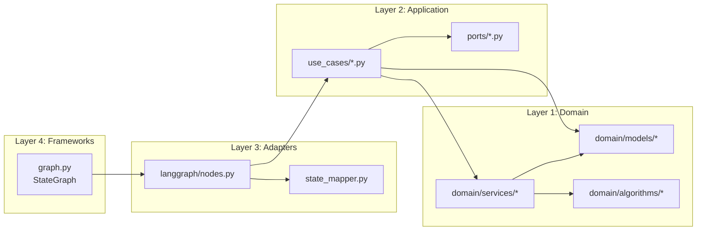
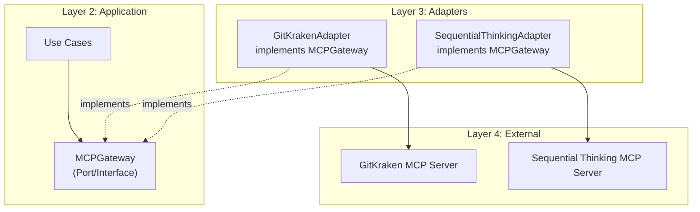
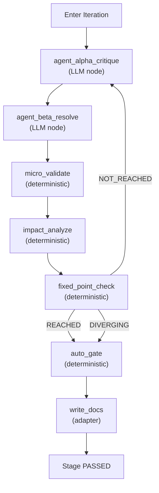

# Clean Architecture Design — LangGraph Agentic Workflow System

> **Generated by**: Stage 5 OOAD (s2c-domain-model.md + Clean Architecture)
> **Traceable to**: FEA-001, FEA-011, ADR-STR-001
> **Last Updated**: 2026-05-14T18:40+08:00 (v2: autonomous + DAG state)

---

## 1. Architectural Overview

Clean Architecture enforces the **Dependency Rule**: source code dependencies
point inward only. Inner layers know nothing about outer layers.

```
┌─────────────────────────────────────────────────────────────────┐
│                    Frameworks & Drivers                         │
│  ┌───────────────────────────────────────────────────────────┐  │
│  │                  Interface Adapters                        │  │
│  │  ┌─────────────────────────────────────────────────────┐  │  │
│  │  │               Application (Use Cases)                │  │  │
│  │  │  ┌───────────────────────────────────────────────┐  │  │  │
│  │  │  │              Domain (Entities)                 │  │  │  │
│  │  │  │                                               │  │  │  │
│  │  │  │  CLS-001..014, ALG-001..005, INV-001..019    │  │  │  │
│  │  │  │  EVT-001..007, TraceableID, TraceLink         │  │  │  │
│  │  │  └───────────────────────────────────────────────┘  │  │  │
│  │  │                                                     │  │  │
│  │  │  UC-001..011 (Use Case Interactors)                │  │  │
│  │  │  Ports (Repository/Gateway interfaces)              │  │  │
│  │  └─────────────────────────────────────────────────────┘  │  │
│  │                                                           │  │
│  │  LangGraph Nodes, MCP Adapters, File Adapters             │  │
│  │  State Mappers, Event Publishers                          │  │
│  └───────────────────────────────────────────────────────────┘  │
│                                                                 │
│  LangGraph StateGraph, MCP Servers, Filesystem, LLM Providers  │
└─────────────────────────────────────────────────────────────────┘
```

---

## 2. Layer Definitions

### Layer 1: Domain (Entities + Value Objects + Domain Services)

**Purpose**: Pure business logic. Zero external dependencies.
**Depends on**: Nothing.

| Module | ID | DDD Stereotype | Responsibility |
|--------|----|----------------|----------------|
| `domain/pipeline.py` | CLS-001 | Aggregate Root | Pipeline lifecycle, position tracking |
| `domain/stage.py` | CLS-002 | Value Object | Stage definition, status transitions |
| `domain/iteration_loop.py` | CLS-003 | Domain Service | Agent α/β convergence protocol |
| `domain/traceable_id.py` | CLS-004 | Aggregate Root | ID identity, link management |
| `domain/trace_link.py` | CLS-005 | Value Object | Bidirectional trace relationship |
| `domain/micro_validator.py` | CLS-006 | Domain Service | 6-step validation sequence |
| `domain/impact_analyzer.py` | CLS-007 | Domain Service | Blast radius calculation |
| `domain/quality_gate.py` | CLS-008 | Value Object | Quality threshold definition |
| `domain/debt_item.py` | CLS-009 | Entity | Tech debt with RICE scoring |
| `domain/security_auditor.py` | CLS-010 | Domain Service | 3-layer security audit |
| `domain/completion_checker.py` | CLS-011 | Domain Service | Pre-release readiness check |
| `domain/scope_analyzer.py` | CLS-012 | Domain Service | Phase 2 scope analysis |
| `domain/workflow_resumer.py` | CLS-013 | Domain Service | Breakpoint recovery |
| `domain/crosslink_tracer.py` | CLS-014 | Domain Service | Full-direction link tracing |
| `algorithms/convergence.py` | ALG-001 | Algorithm | Iteration convergence (deterministic) |
| `algorithms/micro_validation.py` | ALG-002 | Algorithm | Validation sequence (deterministic) |
| `algorithms/blast_radius.py` | ALG-003 | Algorithm | Impact calculation (deterministic) |
| `algorithms/rice_scoring.py` | ALG-004 | Algorithm | RICE prioritization (deterministic) |
| `algorithms/trace_traversal.py` | ALG-005 | Algorithm | Graph traversal (deterministic) |
| `events/domain_events.py` | EVT-001..007 | Domain Event | Immutable event dataclasses |
| `invariants/contracts.py` | INV-001..019 | Contract | deal predicate functions |

**Key rules**:
- All domain classes use `deal` decorators for pre/ensure/inv
- All algorithms are **deterministic** (no LLM, no I/O)
- Domain events are frozen dataclasses
- No imports from outer layers

### Layer 2: Application (Use Cases / Interactors)

**Purpose**: Orchestrate domain objects to fulfill use cases.
**Depends on**: Domain layer only (via abstract ports).

| Module | ID | Responsibility |
|--------|----|----------------|
| `use_cases/start_pipeline.py` | UC-001 | Start new project pipeline |
| `use_cases/analyze_project.py` | UC-002 | Execute Phase 2 analysis |
| `use_cases/run_iteration.py` | UC-003 | Execute iterative stage (α/β loop) |
| `use_cases/validate_change.py` | UC-004 | Execute micro-validation |
| `use_cases/analyze_impact.py` | UC-005 | Execute impact analysis |
| `use_cases/audit_security.py` | UC-006 | Execute 3-layer security audit |
| `use_cases/check_quality.py` | UC-007 | Execute SonarCloud quality gate |
| `use_cases/manage_debt.py` | UC-008 | Manage tech debt lifecycle |
| `use_cases/check_completion.py` | UC-009 | Pre-release completion check |
| `use_cases/resume_workflow.py` | UC-010 | Resume from breakpoint |
| `use_cases/trace_crosslinks.py` | UC-011 | Full-chain impact tracing |

**Ports (abstract interfaces defined here)**:

```
ports/
├── repositories.py     # TraceableIDRepository, CheckpointRepository
├── gateways.py         # LLMGateway, MCPGateway, SecurityGateway, QualityGateway
├── doc_io.py           # DocumentIOGateway (read/write Markdown docs)
└── event_bus.py        # DomainEventBus (publish/subscribe)
```

**Key rules**:
- Use cases call domain services through ports (interfaces)
- No direct filesystem, LLM, or MCP access
- Each use case is a single class with one public `execute()` method
- Returns domain DTOs, not framework-specific types

### Layer 3: Interface Adapters

**Purpose**: Convert data between use case format and external format.
**Depends on**: Application layer ports.

| Module | Responsibility |
|--------|----------------|
| `adapters/langgraph_nodes.py` | Map WorkflowState ↔ Use Case DTOs |
| `adapters/mcp_gitkraken.py` | Implement MCPGateway for GitKraken |
| `adapters/mcp_sequential.py` | Implement MCPGateway for Sequential Thinking |
| `adapters/file_repository.py` | Implement repositories via filesystem |
| `adapters/llm_adapter.py` | Implement LLMGateway (Agent α/β) |
| `adapters/markdown_writer.py` | Implement DocumentIOGateway (write docs) |
| `adapters/markdown_reader.py` | Implement DocumentIOGateway (read docs) |
| `adapters/checkpoint_repository.py` | Implement CheckpointRepository (LangGraph checkpoint) |
| `adapters/event_publisher.py` | Implement DomainEventBus |

**Key rules**:
- Adapters implement port interfaces
- LangGraph nodes live here (not in domain!)
- MCP protocol details are encapsulated here
- LLM provider details (OpenAI, Anthropic, etc.) are encapsulated here

### Layer 4: Frameworks & Drivers

**Purpose**: Framework configuration and wiring.
**Depends on**: All inner layers (composition root).

| Module | Responsibility |
|--------|----------------|
| `graph.py` | LangGraph StateGraph construction |
| `config.py` | Configuration loading |
| `main.py` | Entry point, dependency injection |

**Key rules**:
- This is the only layer that knows about LangGraph StateGraph
- Dependency injection happens here (wiring ports to adapters)
- Configuration and environment setup

---

## 3. Dependency Rule Verification Matrix

```
Domain ──────── imports ──────── nothing external
  ↑
Application ─── imports ──────── Domain (entities, ports)
  ↑
Adapters ────── imports ──────── Application (ports, DTOs)
  ↑                              Domain (entities, for mapping)
Frameworks ──── imports ──────── All (composition root)
```

| From \ To | Domain | Application | Adapters | Frameworks |
|-----------|--------|-------------|----------|------------|
| Domain | ✅ self | ❌ | ❌ | ❌ |
| Application | ✅ | ✅ self | ❌ | ❌ |
| Adapters | ✅ | ✅ | ✅ self | ❌ |
| Frameworks | ✅ | ✅ | ✅ | ✅ self |

---

## 4. Package Structure (Clean Architecture)

```
src/agentic_workflow/
├── domain/                          # Layer 1: Entities
│   ├── __init__.py
│   ├── models/                      # Value Objects + Entities
│   │   ├── pipeline.py              # CLS-001
│   │   ├── stage.py                 # CLS-002
│   │   ├── traceable_id.py          # CLS-004
│   │   ├── trace_link.py            # CLS-005
│   │   ├── quality_gate.py          # CLS-008
│   │   ├── debt_item.py             # CLS-009
│   │   └── enums.py                 # All enumerations
│   ├── services/                    # Domain Services
│   │   ├── iteration_loop.py        # CLS-003
│   │   ├── micro_validator.py       # CLS-006
│   │   ├── impact_analyzer.py       # CLS-007
│   │   ├── security_auditor.py      # CLS-010
│   │   ├── completion_checker.py    # CLS-011
│   │   ├── scope_analyzer.py        # CLS-012
│   │   ├── workflow_resumer.py      # CLS-013
│   │   └── crosslink_tracer.py      # CLS-014
│   ├── algorithms/                  # Pure deterministic algorithms
│   │   ├── convergence.py           # ALG-001
│   │   ├── micro_validation.py      # ALG-002
│   │   ├── blast_radius.py          # ALG-003
│   │   ├── rice_scoring.py          # ALG-004
│   │   └── trace_traversal.py       # ALG-005
│   ├── events/                      # Domain events
│   │   └── domain_events.py         # EVT-001..007
│   └── contracts/                   # deal predicates
│       └── invariants.py            # INV-001..019
│
├── application/                     # Layer 2: Use Cases
│   ├── __init__.py
│   ├── use_cases/                   # UC-001..011
│   │   ├── start_pipeline.py        # UC-001
│   │   ├── analyze_project.py       # UC-002
│   │   ├── run_iteration.py         # UC-003
│   │   ├── validate_change.py       # UC-004
│   │   ├── analyze_impact.py        # UC-005
│   │   ├── audit_security.py        # UC-006
│   │   ├── check_quality.py         # UC-007
│   │   ├── manage_debt.py           # UC-008
│   │   ├── check_completion.py      # UC-009
│   │   ├── resume_workflow.py       # UC-010
│   │   └── trace_crosslinks.py      # UC-011
│   ├── ports/                       # Abstract interfaces
│   │   ├── repositories.py          # Data access interfaces
│   │   ├── gateways.py              # External service interfaces
│   │   ├── doc_io.py                # Document I/O interface
│   │   └── event_bus.py             # Event publishing interface
│   └── dtos/                        # Data Transfer Objects
│       └── workflow_dtos.py
│
├── adapters/                        # Layer 3: Interface Adapters
│   ├── __init__.py
│   ├── langgraph/                   # LangGraph integration
│   │   ├── nodes.py                 # Node functions
│   │   └── state_mapper.py          # WorkflowState ↔ Domain mapping
│   ├── mcp/                         # MCP server adapters
│   │   ├── gitkraken_adapter.py     # GitKraken MCP
│   │   └── sequential_adapter.py    # Sequential Thinking MCP
│   ├── persistence/                 # File-based repositories
│   │   ├── file_repository.py       # TraceableID repo
│   │   ├── checkpoint_repository.py # LangGraph checkpoint repo
│   │   ├── markdown_writer.py       # Write docs to {target_repo}/docs/
│   │   └── markdown_reader.py       # Read docs from {target_repo}/docs/
│   ├── llm/                         # LLM provider adapters
│   │   └── llm_adapter.py           # Agent α/β LLM calls
│   └── events/                      # Event infrastructure
│       └── in_memory_bus.py         # In-memory event bus
│
└── frameworks/                      # Layer 4: Frameworks & Drivers
    ├── __init__.py
    ├── graph.py                     # LangGraph StateGraph definition
    ├── config.py                    # Configuration
    └── main.py                      # Entry point + DI wiring
```

---

## 5. LangGraph Integration Point

LangGraph is a **Framework** (Layer 4). It does NOT penetrate inner layers.



**Node function pattern** (adapter layer):

```python
# adapters/langgraph/nodes.py (DESIGN ONLY — not production code)

def session_gate_start_node(state: WorkflowState) -> WorkflowState:
    """LangGraph node for Step 0: Session Gate Start.

    1. Map WorkflowState → Domain DTOs
    2. Call use_case.execute()
    3. Map Domain result → WorkflowState updates
    """
    # state_mapper converts LangGraph state to domain DTOs
    snapshot = state_mapper.to_workflow_snapshot(state)

    # Use case lives in application layer, knows nothing about LangGraph
    result = resume_workflow_use_case.execute(snapshot)

    # Map back to LangGraph state
    return state_mapper.to_state_update(result)
```

---

## 6. MCP Integration Architecture



**MCPGateway Port** (application layer):

```python
# ports/gateways.py (DESIGN ONLY)

class MCPGateway(Protocol):
    """Abstract gateway for MCP server interactions.

    Domain and application layers call this interface.
    Adapter layer provides concrete implementations.
    """

    def git_status(self, directory: str) -> GitStatusResult: ...
    def git_commit(self, directory: str, message: str) -> CommitResult: ...
    def git_branch(self, directory: str, action: str) -> BranchResult: ...
    def think_sequentially(self, problem: str) -> ThinkingResult: ...
```

---

## 7. Iteration Subgraph (LangGraph)

The Agent α/β iteration loop (ALG-001) is a **reusable subgraph**
used by Stage 3 through Stage 8.



**Critical**: micro_validate, impact_analyze, fixed_point_check, and auto_gate
are all **deterministic nodes**. Only agent_alpha and agent_beta use LLM.
No human node in the graph.

---

## 8. ADR: Clean Architecture Adoption

> **ADR-STR-002**: Adopt Clean Architecture for LangGraph Migration

**Status**: Accepted

**Context**: The existing system is document-driven (Markdown skills read by AI agents).
The migration to LangGraph introduces Python code that must be structured to:
- Keep domain logic framework-independent (testable without LangGraph)
- Allow MCP server swapping without domain changes
- Allow LLM provider swapping without domain changes

**Decision**: Adopt Clean Architecture with 4 layers:
1. Domain (entities, services, algorithms, events, contracts)
2. Application (use cases, ports)
3. Adapters (LangGraph nodes, MCP adapters, persistence)
4. Frameworks (graph construction, configuration, DI wiring)

**Consequences**:
- (+) Domain logic is 100% testable without any framework
- (+) MCP servers are swappable via port interfaces
- (+) LLM providers are swappable via port interfaces
- (+) LangGraph can be replaced without touching domain/application
- (-) More files and indirection than a flat structure
- (-) State mapping between LangGraph TypedDict and domain objects

**FR Justification**: FR-001, FR-002, FR-003 (architecture separation)
**NFR Justification**: NFR-002 (submodule read-only → encapsulate via ports)
