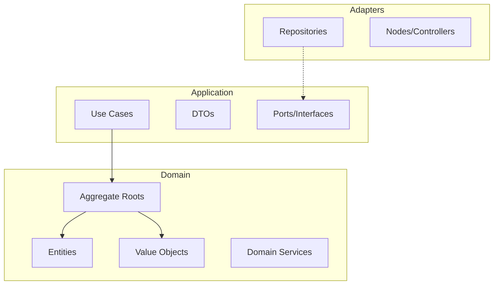

# DDD Refactoring Implementation Plan

## Overview
This plan outlines the systematic refactoring of the `src` directory to align with Domain-Driven Design (DDD) principles.

## Target Architecture

### Phase 1: Core Domain Refactoring (Core Models) ✅
- [x] 建立 `src/agentic_workflow/domain/value_objects/` 並實作 `Findings`, `RepoMap`, `SymbolDef`, `TraceLink`。
- [x] 建立 `src/agentic_workflow/domain/entities/` 並實作 `Stage`, `TraceableID`。
- [x] 建立 `src/agentic_workflow/domain/aggregates/` 並實作 `Pipeline` 聚合根。

### Phase 2: Application Layer Implementation (Use Cases) ✅
- [x] 建立 `src/agentic_workflow/application/use_cases/`。
- [x] 實作 `StartPipelineUseCase`, `AdvancePipelineUseCase`, `RunIterationUseCase`。
- [x] 將業務邏輯從 Adapter 層抽離至 Use Case。

### Phase 3: Adapters & Frameworks Alignment 🔄
- [x] 更新 `StateMapper` 映射結構。
- [x] 更新 LangGraph `nodes.py` 調用 Use Cases。
- [ ] 移除 `src/agentic_workflow/domain/models/` 中的遺留代碼。
- [ ] 整合 `TraceabilityRegistry` 聚合根。

### Phase 4: Quality Gate
- [ ] 4.1: Run `ruff check src`
- [ ] 4.2: Run `mypy src`
- [ ] 4.3: Run `pytest` to ensure 100% coverage is maintained.

## Traceability
- **FEA-025** -> FR-051, FR-052, FR-053
- **ADR-STR-020**
