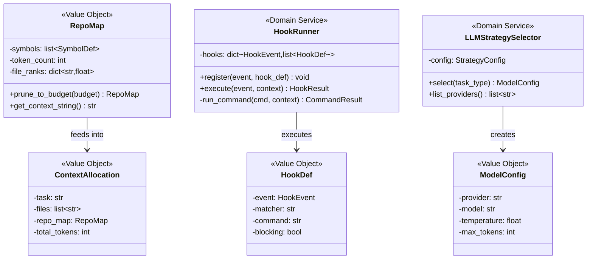
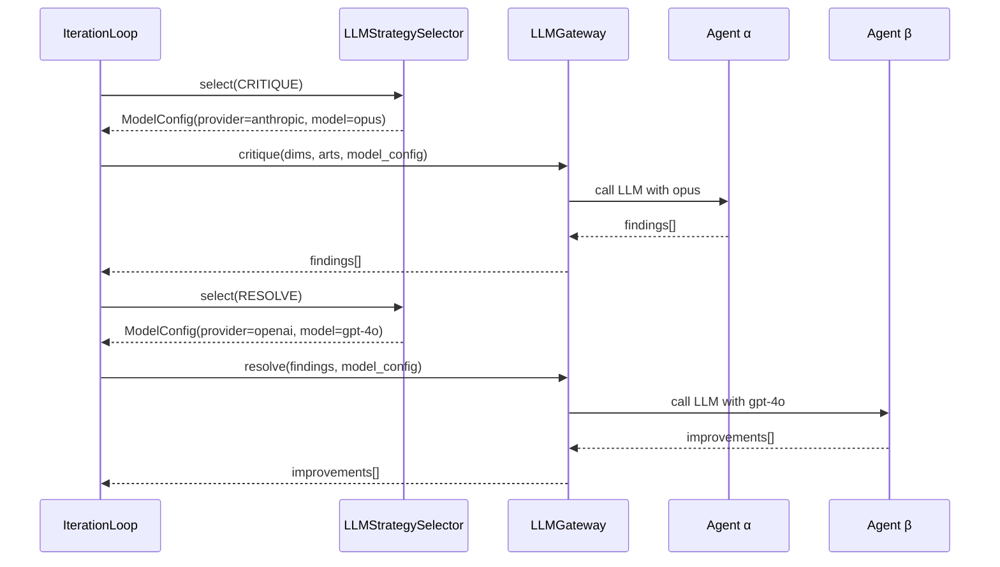
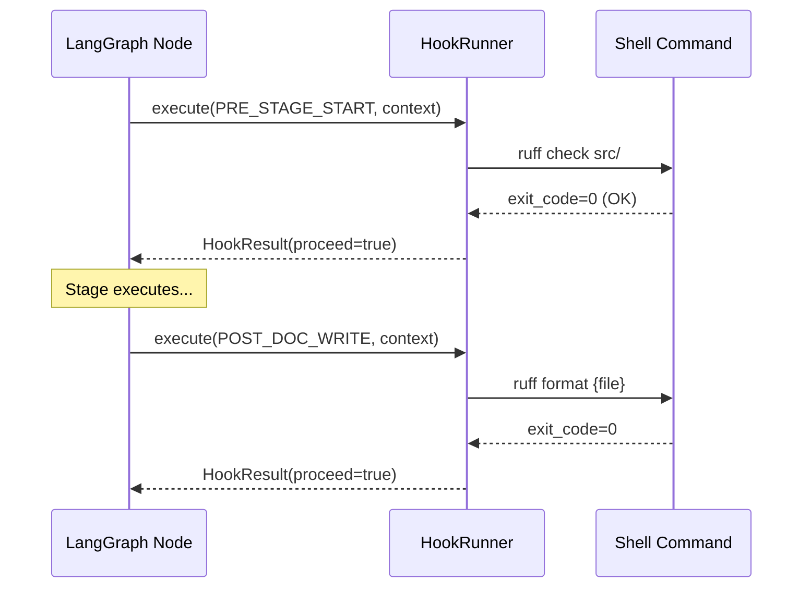

# Feature Absorption Design — AI Tool Features into LangGraph

> **Triggered by**: User directive 2026-05-14T19:01
> **Change Type**: MAJOR (5 features absorbed, 2 removed)
> **ADR**: ADR-STR-004 (new)
> **Last Updated**: 2026-05-14T19:02+08:00

---

## 1. Scope Decisions

| Feature | Decision | Rationale |
|---------|----------|-----------|
| Multi-agent parallel | **REMOVED** | Not supported per user directive |
| Memory curation / Dreaming | **REMOVED** | Step 12 left-shift handles this |
| Strategy Pattern LLM | **ABSORB P0** | α/β need different models; cost optimization |
| RepoMap (tree-sitter) | **ABSORB P0** | Core context for Phase 1 |
| Atomic Git Commits | **ABSORB P1** | Traceability of AI changes |
| Lifecycle Hooks | **ABSORB P1** | Deterministic quality enforcement |
| Context Budget | **ABSORB P1** | Token cost control + LLM performance |
| Auto-Format on Write | **ABSORB P1** | Via Hooks (PostDocWrite) |

---

## 2. New Requirements (Stage 3)

### 2.1 New FRs

| ID | Description | Traceable to |
|----|-------------|-------------|
| FR-026 | RepoMap: tree-sitter AST parse + PageRank ranking of repo symbols | FEA-011 |
| FR-027 | Atomic Git commit at each stage completion via GitKraken MCP | FEA-011 |
| FR-028 | Lifecycle hooks: PreStageStart, PostStageComplete, PreDocWrite, PostDocWrite | FEA-011 |
| FR-029 | Strategy Pattern: select LLM provider+model per task_type (α=reasoning, β=editing) | FEA-011 |
| FR-030 | Context budget: allocate token budget per LLM request, prune to fit | FEA-011 |

### 2.2 New NFR

| ID | Description | Traceable to |
|----|-------------|-------------|
| NFR-008 | Provider-agnostic: no vendor lock-in; support OpenAI, Anthropic, local | FEA-011 |

### 2.3 New UCs

| ID | Name | FRs Realized |
|----|------|-------------|
| UC-012 | GenerateRepoMap | FR-026 |
| UC-013 | ExecuteHook | FR-028 |

---

## 3. Algorithm Design (Stage 4)

### ALG-006: RepoMapBuilder (registered, now fully specified)

```
repo_map_build(project_path, token_budget):
  PRE: project_path exists AND token_budget > 0
  POST: len(output_tokens) <= token_budget

  files = scan_python_files(project_path)
  tags = {}
  FOR each file IN files:
    ast = tree_sitter_parse(file, language="python")
    tags[file] = extract_definitions(ast)  # classes, functions, methods
    refs[file] = extract_references(ast)   # imports, calls

  # Build directed graph: file → file (via import/reference)
  graph = build_dependency_graph(tags, refs)

  # PageRank: weight files already in context higher
  ranks = personalized_pagerank(graph, personalization=context_files)

  # Select top-ranked symbols within budget
  selected = []
  token_count = 0
  FOR symbol IN sorted(all_symbols, key=ranks, reverse=True):
    cost = estimate_tokens(symbol.signature)
    IF token_count + cost > token_budget:
      BREAK
    selected.append(symbol)
    token_count += cost

  RETURN RepoMap(symbols=selected, token_count=token_count)
```

### ALG-007: ContextBudgetAllocator (registered, now fully specified)

```
allocate_budget(total_budget, repo_map, current_files, task_context):
  PRE: total_budget > 0
  POST: sum(allocated) <= total_budget

  # Priority: task_context > current_files > repo_map
  task_budget = min(total_budget * 0.5, estimate_tokens(task_context))
  remaining = total_budget - task_budget

  files_budget = min(remaining * 0.7, estimate_tokens(current_files))
  remaining -= files_budget

  map_budget = remaining  # repo_map gets the rest
  pruned_map = repo_map.prune_to_budget(map_budget)

  RETURN ContextAllocation(
    task=task_context,
    files=current_files,
    repo_map=pruned_map,
    total_tokens=task_budget + files_budget + map_budget
  )
```

### ALG-008: ModelSelector (NEW — deterministic Strategy Pattern)

```
select_model(task_type, config):
  PRE: task_type IN {CRITIQUE, RESOLVE, COMPREHEND, CHARTER, FORMAT}
  PRE: config.providers is not empty
  POST: result.provider IN config.providers
  POST: result.model IN config.available_models

  strategy_map = {
    CRITIQUE:    config.reasoning_model,    # Agent α: high-reasoning (o1/Opus)
    RESOLVE:     config.editing_model,       # Agent β: fast-editing (Sonnet/GPT-4o)
    COMPREHEND:  config.reasoning_model,     # Phase 1: needs deep understanding
    CHARTER:     config.reasoning_model,     # Phase 2: business analysis
    FORMAT:      config.cheap_model,         # Simple formatting: cheapest model
  }

  selected = strategy_map.get(task_type, config.default_model)

  IF selected.provider not in config.enabled_providers:
    selected = config.fallback_model  # Graceful degradation

  RETURN ModelConfig(
    provider=selected.provider,
    model=selected.model,
    temperature=selected.temperature,
    max_tokens=selected.max_tokens
  )
```

---

## 4. OOAD Updates (Stage 5)

### 4.1 New Domain Classes



### 4.2 Updated Port Interfaces

```python
# application/ports/gateways.py — additions

class LLMGateway(Protocol):
    # existing methods...
    def critique(self, dims, arts, model: ModelConfig) -> list[Finding]: ...
    def resolve(self, findings, model: ModelConfig) -> list[Improvement]: ...

class MCPGateway(Protocol):
    # existing methods + NEW:
    def auto_commit(self, directory: str, message: str, files: list[str]) -> CommitResult: ...
```

### 4.3 Updated Component Diagram Additions

| Layer | New Component | Responsibility |
|-------|--------------|----------------|
| Domain/Models | `repo_map.py` (CLS-015) | RepoMap value object |
| Domain/Models | `model_config.py` (CLS-018) | ModelConfig + ContextAllocation VOs |
| Domain/Services | `hook_runner.py` (CLS-016) | Hook lifecycle execution |
| Domain/Services | `llm_strategy_selector.py` (CLS-017) | Strategy Pattern model selection |
| Domain/Algorithms | `repo_map_builder.py` (ALG-006) | tree-sitter + PageRank |
| Domain/Algorithms | `context_budget.py` (ALG-007) | Token budget allocation |
| Domain/Algorithms | `model_selector.py` (ALG-008) | Deterministic strategy routing |

### 4.4 Sequence Diagram: SD-004 Strategy Pattern LLM Selection



### 4.5 Sequence Diagram: SD-005 Lifecycle Hook Execution



---

## 5. Formal Verification (Stage 6)

### INV-022: Strategy selects configured providers only

```python
@icontract.ensure(
    lambda result, self: result.provider in self._config.enabled_providers
)
def select(self, task_type: TaskType) -> ModelConfig: ...
```

### INV-023: Atomic commit includes all stage artifacts

```python
@icontract.require(lambda files: len(files) > 0)
@icontract.ensure(lambda result: result.committed is True)
def auto_commit(self, directory: str, message: str, files: list[str]) -> CommitResult: ...
```

### INV-024: RepoMap token count within budget

```python
@icontract.ensure(lambda result, token_budget: result.token_count <= token_budget)
def repo_map_build(self, project_path: str, token_budget: int) -> RepoMap: ...
```

---

## 6. BDD Scenarios (Stage 7)

### SC-012: RepoMap Generation

```gherkin
Feature: Repository Map Generation
  Scenario: Generate repo map within token budget
    Given a Python project with 50 files
    And token budget is 1000
    When repo map is generated
    Then the map contains ranked symbols
    And total tokens do not exceed 1000

  Scenario: PageRank prioritizes context files
    Given files A.py and B.py are in current context
    And C.py imports from A.py
    When repo map is generated
    Then A.py symbols rank higher than unrelated files
```

### SC-013: Hook Execution

```gherkin
Feature: Lifecycle Hook Execution
  Scenario: PreStageStart hook runs before stage
    Given a hook is registered for PRE_STAGE_START
    When the stage begins
    Then the hook command executes before stage logic
    And hook exit code 0 allows stage to proceed

  Scenario: Hook exit code 2 blocks execution
    Given a blocking hook returns exit code 2
    When the hook executes
    Then the stage is blocked
    And stderr is logged as a warning

  Scenario: PostDocWrite auto-formats
    Given a PostDocWrite hook runs "ruff format"
    When a Python file is written
    Then the file is auto-formatted
```

### SC-014: LLM Strategy Selection

```gherkin
Feature: LLM Strategy Pattern Selection
  Scenario: Agent alpha uses reasoning model
    Given strategy config has reasoning_model = opus
    When task_type is CRITIQUE
    Then ModelConfig.model is opus

  Scenario: Agent beta uses editing model
    Given strategy config has editing_model = gpt-4o
    When task_type is RESOLVE
    Then ModelConfig.model is gpt-4o

  Scenario: Fallback on disabled provider
    Given provider "anthropic" is disabled
    When task_type is CRITIQUE
    Then fallback_model is selected
    And a warning is logged
```

### SC-015: Atomic Git Commits

```gherkin
Feature: Atomic Git Commits per Stage
  Scenario: Stage completion creates git commit
    Given Stage 3 has completed
    And docs/ contains updated artifacts
    When auto_commit executes
    Then a git commit is created with message "[Stage 3] ..."
    And all stage artifacts are included in the commit

  Scenario: Empty stage creates no commit
    Given a stage produces no artifact changes
    When auto_commit checks for changes
    Then no commit is created
```

### SC-016: Context Budget Allocation

```gherkin
Feature: Context Budget Allocation
  Scenario: Budget split across priorities
    Given total budget is 4000 tokens
    When context is allocated
    Then task context gets up to 50%
    And current files get up to 70% of remainder
    And repo map gets the rest

  Scenario: Budget never exceeded
    Given total budget is 2000 tokens
    When all context is assembled
    Then total allocated tokens do not exceed 2000
```

---

## 7. ID Registry Summary

| ID | Type | Description | Upstream | Downstream |
|----|------|-------------|----------|-----------|
| FR-026 | FR | RepoMap tree-sitter | FEA-011 | UC-012, ALG-006 |
| FR-027 | FR | Atomic Git commits | FEA-011 | UC-003 (stage end) |
| FR-028 | FR | Lifecycle hooks | FEA-011 | UC-013, CLS-016 |
| FR-029 | FR | Strategy LLM selection | FEA-011 | CLS-017, ALG-008 |
| FR-030 | FR | Context budget | FEA-011 | ALG-007 |
| NFR-008 | NFR | Provider-agnostic | FEA-011 | CLS-017 |
| UC-012 | UC | GenerateRepoMap | FR-026 | SC-012 |
| UC-013 | UC | ExecuteHook | FR-028 | SC-013 |
| CLS-017 | CLS | LLMStrategySelector | UC-003, FR-029 | INV-022 |
| CLS-018 | CLS | ModelConfig VO | CLS-017 | — |
| ALG-008 | ALG | ModelSelector | FR-029 | INV-022 |
| INV-022 | INV | Strategy provider constraint | CLS-017 | SC-014 |
| INV-023 | INV | Atomic commit completeness | MCPGateway | SC-015 |
| INV-024 | INV | RepoMap budget constraint | ALG-006 | SC-012 |
| EVT-009 | EVT | GitCommitCreated | MCPGateway | — |
| EVT-010 | EVT | ModelSelected | CLS-017 | — |
| SC-012 | SC | RepoMap scenarios | UC-012 | TC-012 |
| SC-013 | SC | Hook scenarios | UC-013 | TC-013 |
| SC-014 | SC | Strategy selection | UC-003 | TC-014 |
| SC-015 | SC | Atomic git commits | UC-003 | TC-015 |
| SC-016 | SC | Context budget | UC-003 | TC-016 |

**Total new IDs**: 21
