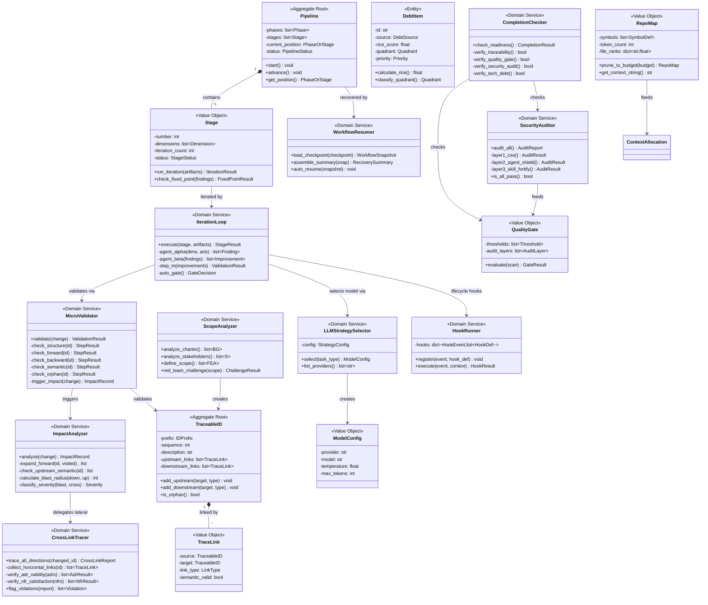
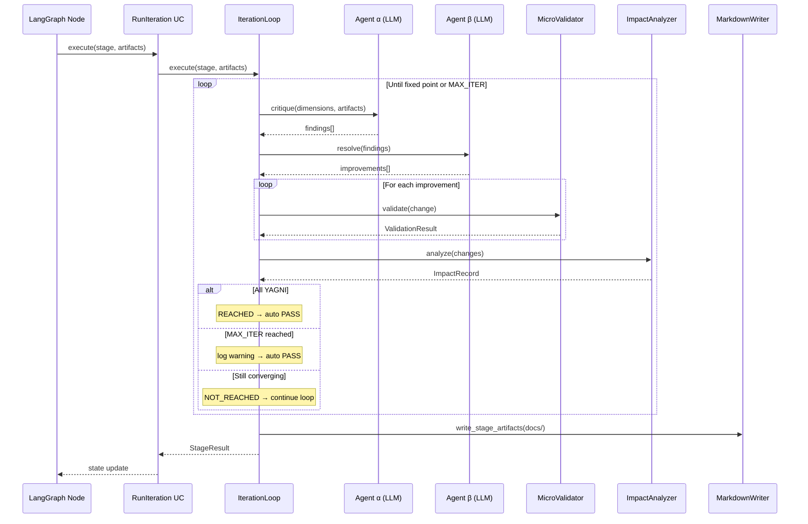
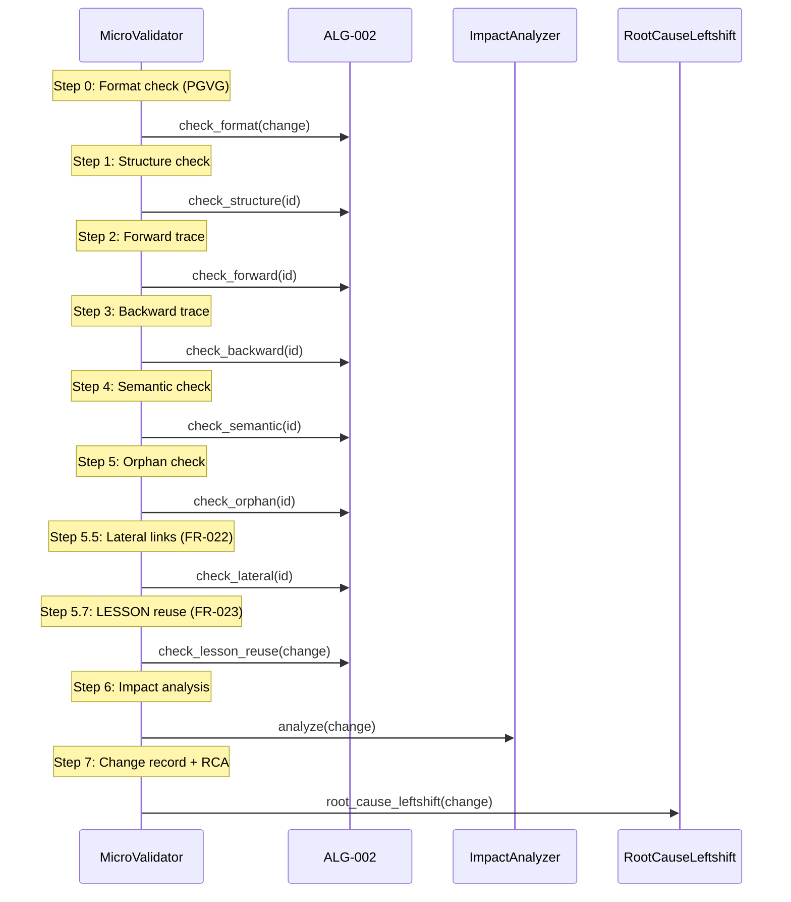
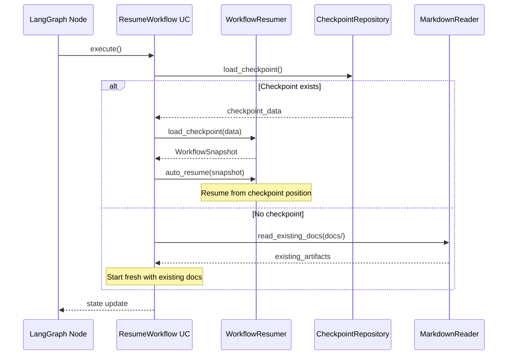
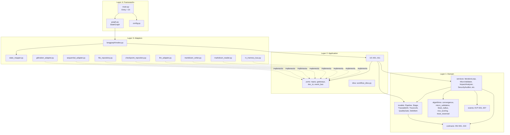

# OOAD Design — LangGraph Agentic Workflow System

> **Generated by**: Stage 5 OOAD (Clean Architecture)
> **Traceable to**: FEA-001..011, CLS-001..018, ALG-001..008
> **Last Updated**: 2026-05-14T19:05+08:00 (v3: AI tool features absorbed)

---

## 1. Bounded Contexts (Updated for Clean Architecture)

| Context | Layer | Modules | UC Coverage |
|---------|-------|---------|-------------|
| Pipeline Orchestration | Domain | pipeline, stage, iteration_loop, workflow_resumer | UC-001, UC-003, UC-010 |
| Traceability Engine | Domain | traceable_id, trace_link, micro_validator, crosslink_tracer | UC-004, UC-005, UC-011 |
| Quality Assurance | Domain | quality_gate, security_auditor, completion_checker | UC-006, UC-007, UC-009 |
| Debt Management | Domain | debt_item | UC-008 |
| Stakeholder Context | Domain | scope_analyzer | UC-002 |
| Workflow Adapters | Adapters | langgraph nodes, mcp adapters, file repos | All UC (infrastructure) |

---

## 2. Class Diagram (Mermaid)



---

## 3. Sequence Diagrams

### SD-001: UC-003 Iteration Stage (Autonomous)



### SD-002: UC-004 Micro-Validation (6-Step)



### SD-003: UC-010 Checkpoint Resume (Autonomous)



---

## 4. Component Diagram



---

## 5. Port Interfaces Design

### 5.1 Repository Ports

```
TraceableIDRepository (Protocol):
    find_by_id(prefix, sequence) -> TraceableID | None
    find_all_by_prefix(prefix) -> list[TraceableID]
    save(id: TraceableID) -> None
    exists(prefix, sequence) -> bool
    next_sequence(prefix) -> int

CheckpointRepository (Protocol):
    load_checkpoint() -> CheckpointData | None
    save_checkpoint(data: CheckpointData) -> None

DocumentIOGateway (Protocol):
    read_docs(docs_path: str) -> dict[str, str]
    write_doc(docs_path: str, filename: str, content: str) -> None
    list_docs(docs_path: str) -> list[str]
```

### 5.2 Gateway Ports

```
LLMGateway (Protocol):
    critique(dimensions, artifacts) -> list[Finding]     # Agent α
    resolve(findings) -> list[Improvement]               # Agent β

MCPGateway (Protocol):
    git_status(directory) -> GitStatusResult
    git_commit(directory, message, files?) -> CommitResult
    git_branch_list(directory) -> list[str]
    git_log(directory, revision_range?) -> list[Commit]
    think_sequentially(thought, number, total) -> ThinkingResult

SecurityGateway (Protocol):
    run_cso_audit() -> AuditResult                       # Layer 1
    run_agent_shield() -> AuditResult                    # Layer 2
    run_skill_fortify() -> AuditResult                   # Layer 3

QualityGateway (Protocol):
    run_sonarcloud_scan() -> ScanResult
```

### 5.3 Document I/O Port (replaces HITLPresenter)

```
DocumentIOGateway (Protocol):
    read_docs(docs_path: str) -> dict[str, str]         # Read all .md files
    write_doc(docs_path: str, filename: str, content: str) -> None
    list_docs(docs_path: str) -> list[str]
    read_doc(docs_path: str, filename: str) -> str | None
```

### 5.4 Event Bus Port

```
DomainEventBus (Protocol):
    publish(event: DomainEvent) -> None
    subscribe(event_type, handler) -> None
```

---

## 6. LLM vs Deterministic Boundary

| Component | Type | Layer | Rationale |
|-----------|------|-------|-----------|
| ALG-001 convergence | Deterministic | Domain | Severity comparison, loop counter |
| ALG-002 micro_validation | Deterministic | Domain | Rule-based structure/trace checks |
| ALG-003 blast_radius | Deterministic | Domain | Graph traversal + threshold rules |
| ALG-004 rice_scoring | Deterministic | Domain | Pure arithmetic formula |
| ALG-005 trace_traversal | Deterministic | Domain | BFS/DFS graph algorithm |
| Agent α critique | **LLM** | Adapter | Requires contextual understanding |
| Agent β resolve | **LLM** | Adapter | Requires creative synthesis |
| Phase 1 understand | **LLM** | Adapter | Code comprehension |
| Phase 2 charter | **LLM** | Adapter | Business analysis |
| Auto-gate decision | Deterministic | Domain | Fixed-point → PASS; diverging → PASS+warning |
| ALG-006 RepoMapBuilder | Deterministic | Domain | tree-sitter AST + PageRank graph ranking |
| ALG-007 ContextBudget | Deterministic | Domain | Priority-based token allocation |
| ALG-008 ModelSelector | Deterministic | Domain | Strategy Pattern: task_type → model config |

---

## 7. Traceable ID to Source Mapping

| ID | Source File (Clean Architecture path) |
|----|--------------------------------------|
| CLS-001 | `domain/models/pipeline.py` |
| CLS-002 | `domain/models/stage.py` |
| CLS-003 | `domain/services/iteration_loop.py` |
| CLS-004 | `domain/models/traceable_id.py` |
| CLS-005 | `domain/models/trace_link.py` |
| CLS-006 | `domain/services/micro_validator.py` |
| CLS-007 | `domain/services/impact_analyzer.py` |
| CLS-008 | `domain/models/quality_gate.py` |
| CLS-009 | `domain/models/debt_item.py` |
| CLS-010 | `domain/services/security_auditor.py` |
| CLS-011 | `domain/services/completion_checker.py` |
| CLS-012 | `domain/services/scope_analyzer.py` |
| CLS-013 | `domain/services/workflow_resumer.py` |
| CLS-014 | `domain/services/crosslink_tracer.py` |
| CLS-015 | `domain/models/repo_map.py` |
| CLS-016 | `domain/services/hook_runner.py` |
| CLS-017 | `domain/services/llm_strategy_selector.py` |
| CLS-018 | `domain/models/model_config.py` |
| ALG-001 | `domain/algorithms/convergence.py` |
| ALG-002 | `domain/algorithms/micro_validation.py` |
| ALG-003 | `domain/algorithms/blast_radius.py` |
| ALG-004 | `domain/algorithms/rice_scoring.py` |
| ALG-005 | `domain/algorithms/trace_traversal.py` |
| ALG-006 | `domain/algorithms/repo_map_builder.py` |
| ALG-007 | `domain/algorithms/context_budget.py` |
| ALG-008 | `domain/algorithms/model_selector.py` |
| EVT-001..010 | `domain/events/domain_events.py` |
| INV-001..024 | `domain/contracts/invariants.py` |
| UC-001..013 | `application/use_cases/*.py` |
| SC-001..016 | `tests/features/*.feature` |
